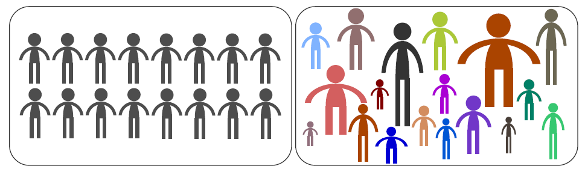
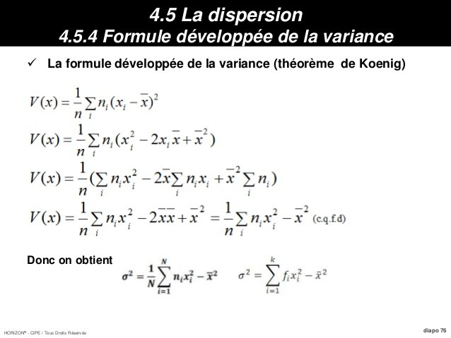
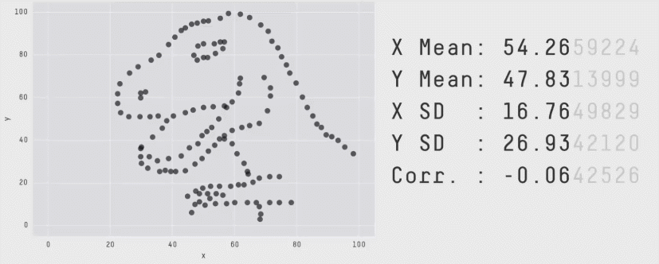
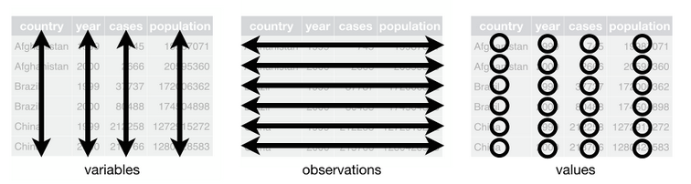
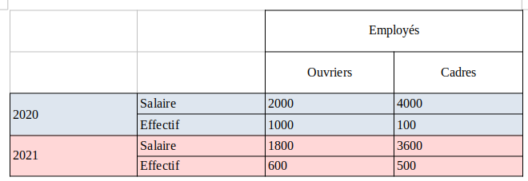
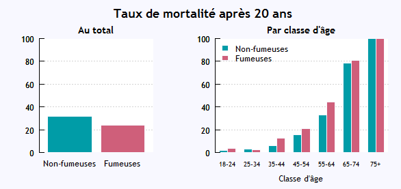
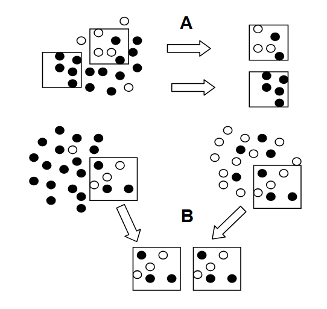
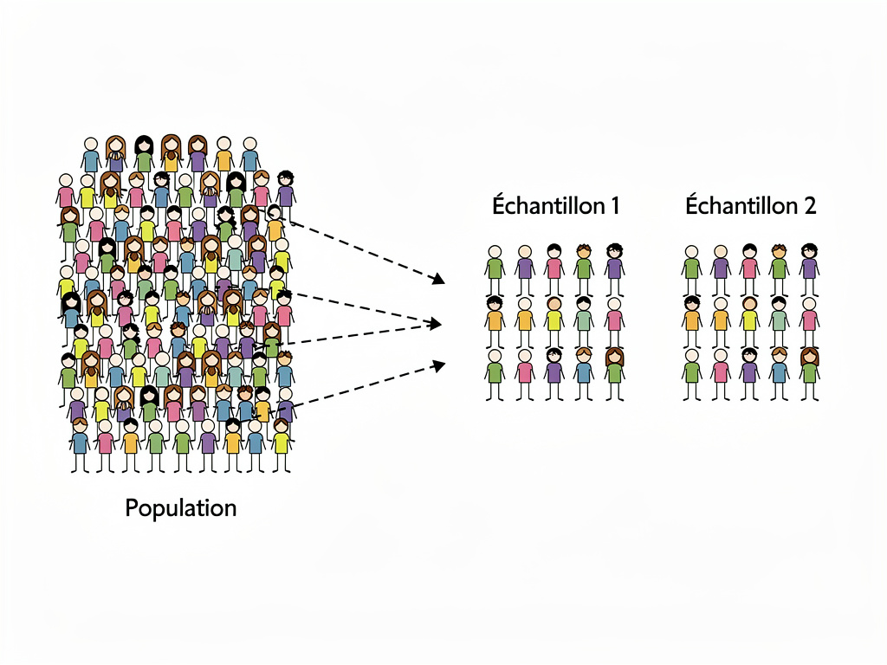
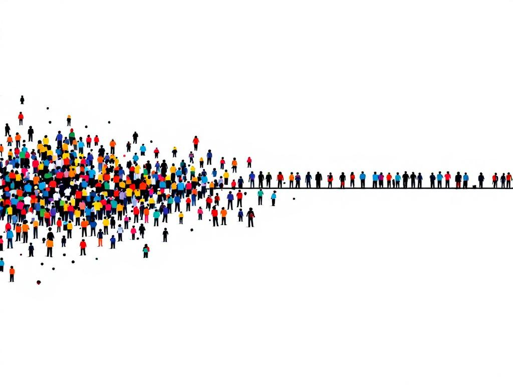

## Nos objectifs

::: r-stack
{width="500"}
:::

::: {style="font-size: 0.85em;margin-top:20px;"}
**Avant tout ne pas vous dégoûter des stats !**
:::

<br/>

::: {style="font-size: 0.85em;margin-top:15px;color:#3498db;"}
[**En bref, à l'issue du cours vous ne serez pas des experts, mais vous aurez quelque armes pour démarrer l'exploration de vos données !**]{style="color:#e74c3c;"}
:::

------------------------------------------------------------------------

## Nos objectifs II

::: {style="font-size: 0.8em;margin-top:15px;"}
À part ça :

1.  Vous montrez l'intérêt des statistiques exploratoires
2.  Vous aidez à réaliser vos premiers pas en base de données
3.  Vous enseignez les premiers indicateurs statistiques utiles pour l'exploration des données
4.  Vous montrer les différents mondes de la statistiques et leurs outils
5.  (Représenter graphiquement vos données)
:::

------------------------------------------------------------------------

## Un peu d'histoire...

::: r-stack
{width="400" style="margin-top:10px; margin-bottom:0px"}
:::

::: {style="font-size: 0.8em;margin-top:20px;"}
La statistique est à l'origine réalisée surtout par les états dans des objectifs de dénombrement, d'inventaire et de recensement pour des besoins avant tout **militaire et bien sur économique**.

> Le mot statistique est d'ailleurs d'origine latine et vient de status qui signifie Etat.
:::

::: notes
Parmi les plus vieilles traces de recensements on peut remonter jusqu'à l'époque sumérienne entre 3000 et 5000 av. JC.

Sur ce sujet précis les anecdotes varient, on entend aussi qu'on retrouverait les premières traces de statistiques en Chine.
:::

------------------------------------------------------------------------

## Encore quelques repères historiques.

::: {style="font-size: 0.8em;margin-top:20px;"}
A la renaissance (aux alentours du 17ème siècle) on va parler de **l'arithmétique politique** qui constitue la base de la statistique moderne.

> L'arithmétique politique correspond à l'ensemble des *"opérations qui ont pour but des recherches utiles à l'art de gouverner" Diderot*. Par ex : le nombre d'hommes habitant le pays, le nombre de naufrages sur tel route maritime...
:::

<br/>

::: {style="font-size: 0.7em;margin-top:15px;"}
C'est au 19ème siècle que les statistiques vont prendre leur essor avec le développement de méthodes et de lois statistiques notamment grâce à des mathématiciens comme Laplace, Gauss, Pearson, Poisson...
:::

::: notes
C'est seulement au 20ème siècle que les statistiques deviennent une science à part entière et autonome.

Aujourd'hui avec la profusion des données et du le big data, la statistique a pris un rôle capital. Et le statisticien est devenu le data scientist !
:::

------------------------------------------------------------------------

## Qu'est-ce que la statistique ?

::: r-stack
{width="700" style="margin-top:10px; margin-bottom:0px"}
:::

::: {style="font-size: 0.6em;margin-top:20px;"}
Principe 1 : **Tout peut être quantifier**
:::

::: {style="font-size: 0.6em;margin-top:20px;"}
Principe 2 : **Toujours il existe de la variation aussi minime soit-elle.**
:::

::: {style="font-size: 0.6em;margin-top:20px;"}
Principe 3 : **Il existe quasiment toujours des mécanismes généraux qui permettent d’analyser et d’expliquer la variation.**
:::

::: {style="font-size: 0.6em;margin-top:0px;color:#3498db;"}
**La statistique est donc l’étude quantifiée de cette variation.**
:::

::: {style="font-size: 0.6em;margin-top:0px;color:#3498db;"}
La statistique c'est un ensemble d'outils dont le but est de nous permettre de **décrire et d'analyser des phénomènes observés**
:::

::: notes
Elle permet ausi entre autre :

-   De créer une information systématique qui permet donc la comparaison.
-   De traiter et analyser l'information : étudier le lien entre les observations, la cause...
-   De résumer et représenter l'information : faire des tableaux croisés, des graphiques...
-   De vérifier la fiabilité de l'information : notamment en cas de sondage.
-   De permettre le premier pas de la réutilisation de l'information dans le but d'une application.

En revanche la statistique **ne permet pas** de remplacer le raisonnement explicatif ou la connaissance et l'expertise du phénomène étudié. **Elle ne remplace pas tout simplement l'esprit critique**.
:::

------------------------------------------------------------------------

## Statistique et image I

::: {style="font-size: 0.8em;margin-top:20px;"}
Très souvent l'image que l'on se fait de la statistique ressemble à ça ...
:::

{width="80%" fig-align="center"}

------------------------------------------------------------------------

## Statistique et image II

::: {style="font-size: 0.8em;margin-top:20px;color:#e74c3c;"}
Il ne faut pas oublier que le but premier de la statistique est **d'éclairer et aider à interpréter des phénomènes observables et mesurables**.
:::

::: {style="font-size: 0.8em;margin-top:5px;"}
C'est pourquoi la statistique est aussi liée à l'image et à la représentation graphique.

La statistique c'est donc bien sur des formules mais aussi la traduction et la représentation en image.
:::

::: r-stack
{width="700"}
:::

------------------------------------------------------------------------

##  {background-image="images/playfair.png" background-size="70%"}

::: {style="position: absolute; bottom: 50px; left: 50px; right: 50px; background-color: rgba(0,0,0,0.7); padding: 20px; border-radius: 10px;"}
William Playfair qui illustre en 1786 l'évolution de la dette publique britanique au cours du 18ème siècle.
:::

------------------------------------------------------------------------

##  {background-image="images/Nightingale.jpg" background-size="70%"}

::: {style="position: absolute; bottom: 50px; left: 50px; right: 50px; background-color: rgba(0,0,0,0.7); padding: 20px; border-radius: 10px;"}
Florence Nightingale en 1859 sur les causes de la mortalité saisonnière des soldats anglais au sein de son hopital militaire.
:::

------------------------------------------------------------------------

##  {background-image="images/minard.png" background-size="70%"}

::: {style="position: absolute; bottom: 50px; left: 50px; right: 50px; background-color: rgba(0,0,0,0.7); padding: 20px; border-radius: 10px;"}
Robert Minard en 1869 sur la mortalité de l'armée de Napoléon lors de la retraite de Russie
:::

------------------------------------------------------------------------

##  {background-image="images/kaupp.jpeg" background-size="70%"}

::: {style="position: absolute; bottom: 50px; left: 50px; right: 50px; background-color: rgba(0,0,0,0.7); padding: 20px; border-radius: 10px;"}
Et cela se poursuit bien sur aujourd'hui ! Jake Kaupp sur les colisions d'oiseaux
:::

------------------------------------------------------------------------

##  {background-image="images/bigmac.jpeg" background-size="70%"}

::: {style="position: absolute; bottom: 50px; left: 50px; right: 50px; background-color: rgba(0,0,0,0.7); padding: 20px; border-radius: 10px;"}
Christophe Nicault sur l'indice Big Mac
:::

------------------------------------------------------------------------

##  {background-image="images/ramen.jpeg" background-size="60%"}

::: {style="position: absolute; bottom: 50px; left: 50px; right: 50px; background-color: rgba(0,0,0,0.7); padding: 20px; border-radius: 10px;"}
Georgios Karamanis sur les restaurants de Ramen
:::

------------------------------------------------------------------------

## Au commencement de la statistique...La donnée

{width="700" style="margin-top:10px; margin-bottom:0px"}

::: {style="font-size: 0.8em;margin-top:20px;"}
La donnée est au coeur et au commencement de l'analyse statistique !
:::

------------------------------------------------------------------------

## Qu'est ce que la donnée en statistique

::: {style="font-size: 0.8em;margin-top:10px;"}
Une multitude de travaux ont donc tenté de donner une définition (plus ou moins claire) de la donnée.
:::

<br/>

::: {style="font-size: 0.8em;margin-top:10px;"}
Peu importe la définition il faut retenir que la donnée en statistique n’existe pas dans la nature de façon imanente.
:::

<br/>

::: {style="font-size: 0.6em;margin-top:10px;"}
Les données ne sont pas données, il faut les construire, les prendre!

> Elles requièrent en amont un travail de modélisation, d’abstraction, de spécification des concepts, puis des domaines, avant d’imaginer produire des valeurs. Elles sont dépendantes de choix eux-mêmes liés à des usages.
:::

------------------------------------------------------------------------

## Statistique et données

::: {style="font-size: 0.8em;margin-top:20px;"}
[**Rappel: le but de la statistique est donc d'analyser des phénomènes observés.**]{style="color:#4178bc;"}
:::

::: {style="font-size: 0.8em;margin-top:20px;"}
1 - Le premier enjeu de la statistique c'est l'observation du ou des phénomènes que l'on souhaite analyser et comprendre.
:::

::: {style="font-size: 0.8em;margin-top:20px;"}
2 - Vient ensuite l'enjeu la mise en forme de ces observations. C'est à dire la traduction des observations sous une forme qui les rends interpretable, analysable et rend possible l'usage de la statistique. \> C'est la création de la **base de données**.
:::

------------------------------------------------------------------------

## Les variables quantitatives

::: {style="font-size: 0.8em;margin-top:20px;"}
Une variable quantitative permet de mesurer une **grandeur, une quantité**.
:::

<br/>

::: {style="font-size: 0.8em;margin-top:10px;"}
Elle va avoir une forme numérique, et on va pouvoir calculer une somme, une différence, une moyenne...
:::

<br/>

::: {style="font-size: 0.6em;margin-top:10px;"}
Une variable quantitative peut elle même appartenir à deux catégories différentes:

-   **discrète** : elle correspond alors à un nombre fini de valeurs possibles. Exemple : un nombre de logements, d'enfants, un âge...

-   **continue** : correspond à priori, toutes les valeurs possibles. Exemple : une taille, une surface, un salaire, ...
:::

------------------------------------------------------------------------

## Les variables qualitatives

::: {style="font-size: 0.6em;margin-top:20px;"}
Une variable qualitative indique des **caractéristiques qui ne sont pas des quantités**. Les différentes valeurs que peut prendre cette variable sont appelées les **catégories** ou **modalités**.
:::

::: {style="font-size: 0.6em;margin-top:10px;"}
Elle peut être :

-   **ordonnée** : elle va exprimer un ordre. Exemple : “un peu - beaucoup - passionément”
-   **non ordonnée** : elle va exprimer l'appartenance à différents groupe Exemple : une couleur, un groupe sanguin…
:::

::: {style="font-size: 0.6em;margin-top:10px;"}
Une variable qualitative ne permet pas de faire des calculs.

> La moyenne d’un groupe sanguin n’a aucun sens.

En revanche, on pourra faire des tableaux de fréquence.

> Combien de personnes sont A+, B-...
:::

------------------------------------------------------------------------

## Quelle forme pour nos données ?

::: notes
Si nous avons vu les différents types de données, il faut désormais la "ranger", l'"organiser" de manière à les rendre analysable. C'est lors de cette étape que nous allons construire notre **base de données**.
:::

::: {style="font-size: 0.6em;margin-top:20px;"}
La base de donnée est l'organisation de nos données qui va nous permettre de les rendre traitable par la statistique.
:::

{width="50%" fig-align="center"}

::: {style="font-size: 0.6em;margin-top:10px;"}
Par défaut une base de donnée statistique repose sur trois règles interdépendantes :

1- chaque ligne correspond à une observation

2- chaque colonne correspond à une variable

3- chaque valeur est présente dans une unique case de la table
:::

::: {style="font-size: 0.5em; background-color:#B3E5FC; padding:20px; border-radius:10px; margin-top:30px; border-left:5px solid #03A9F4;"}
Ces régles ne sont pas absolu, tout dépendra bien sur de ce que vous voudrez faire. Ces régles fonctionne pour de l'analyse et la représentation statitique mais la cartographie ou l'analyse de réseau pourra demander un autre format...
:::

------------------------------------------------------------------------

## Petit dictionnaire non exhaustif

::: {style="font-size: 0.6em;margin-top:20px;"}
[**La population**]{style="color:#3498db;"} : c'est l'ensemble fini ou non d'individus, d'objets ou d'observations sur lesquels porte notre analyse statistique.

> Exemple : Si on fait une étude sur l'âge des inscrits au Master GTDD l'année 2025, la population c'est l'ensemble des 36 inscrits

[**L'échantillon**]{style="color:#3498db;"} : c'est un sous-ensemble de cette population. L'objectif d'un échantillon est de pouvoir estimer des caractéristiques de la population générale.

> Exemple : Interroger 10 étudiants sur les 36 inscrits au Master GTDD l'année 2025.
:::

<br>

::: {style="font-size: 0.6em;margin-top:20px;"}
[**L'unité statistique**]{style="color:#3498db;"} (ou individu statistique) : c'est l'élément qui compose notre population (ou échantillon). Cette unité peut être humaine (un habitant, un agriculteur...) ou non (une entreprise, une commune, une parcelle...)

> Exemple : Chaque étudiant ou étudiante inscrit au Master GTDD l'année 2024.

<br>

[**N**]{style="color:#3498db;"} ou [**n**]{style="color:#3498db;"} : c'est le nombre d'individus statistiques dans notre population ou échantillon, on parle aussi d'effectif ou de taille.

> Exemple : 36 étudiants inscrits au Master GTDD l'année 2025, donc N=36.
:::

::: {style="font-size: 0.6em;margin-top:20px;"}
[**La variable**]{style="color:#3498db;"} (ou caractère - bcp moins fréquent) : c'est une caractéristique de notre unité statistique. Evidemment une unité statistique peut se décrire à travers de nombreuses variables.

> Exemple : l'âge des étudiants, le sexe, la formation d'origine, l'obtention d'un stage, le nombre de projets tuteurés sur l'année, le salaire après 3 ans...

<br>

[**La modalité**]{style="color:#3498db;"} : correspond au résultat de l'observation d'une variable chez une ou plusieurs unité(s) statistique(s).

> Exemple : 25 ans ; 22 ans / féminin ; masculin ; autre / géographie ; biologie ; géologie / oui ; non / 1 projet ; 2 projets...
:::

<br>

::: {style="font-size: 0.6em;margin-top:15px;background-color:#9b59b6;padding:15px;border-radius:5px;"}
Il n'y a pas de modalité possible sans la connaissance de la variable !
:::

::: {style="font-size: 0.6em;margin-top:20px;"}
[**L'effectif**]{style="color:#3498db;"} est le nombre d'observations d'une même modalité. On le note souvent [**ni**]{style="color:#3498db;"} ou [**fi**]{style="color:#3498db;"}.
:::

<br>

::: {style="font-size: 0.8em;margin-top:15px;"}
[**L'effectif total**]{style="color:#3498db;"} est égale à la somme des effectifs de toutes les modalités qui peuvent être prises par la variable.
:::

::: {style="font-size: 0.6em;margin-top:20px;"}
[**La fréquence**]{style="color:#3498db;"} est égale au rapport entre l'effectif de la modalité et l'effectif total. Elle est donc comprise entre 0 et 1 (ou entre 0% et 100%).
:::

::: {style="font-size: 0.6em;margin-top:15px;background-color:#9b59b6;padding:15px;border-radius:5px;"}
Fréquence d'une modalité = effectif de cette modalité / effectif total

<br>

**La somme des fréquences est toujours égale à 1.**
:::

::: {style="font-size: 0.6em;margin-top:20px;"}
[**L'effectif cumulé croissant d'une modalité**]{style="color:#3498db;"} est le nombre d'unités statistiques qui possèdent la modalité considérée ou une modalité inférieure à celle-ci (dans l'ordre des modalités).
:::

<br>

::: {style="font-size: 0.6em;margin-top:15px;"}
[**La fréquence cumulée croissante d'une modalité**]{style="color:#3498db;"} est le rapport entre l'effectif cumulé de la modalité et l'effectif total.
:::

::: {style="font-size: 0.6em;margin-top:15px;background-color:#9b59b6;padding:15px;border-radius:5px;"}
**Important :** Les effectifs et fréquences cumulés ne peuvent être calculés que pour les variables quantitatives ou les variables qualitatives ordinales.
:::

------------------------------------------------------------------------

## Statistiques et esprit critique

{width="700" fig-align="center" style="margin-top:10px; margin-bottom:0px;"}

------------------------------------------------------------------------

## Statistique = Bullshit ?!

::: {style="font-size: 0.75em;margin-top:20px;" fig-align="center"}
Et bien ce n'est pas entièrement faux! Mais cela vient d'une confusion très importante.

C'est la confusion entre [**LA**]{style="color:#3498db;"} Statistique et [**LES**]{style="color:#3498db;"} statistiques.
:::

<br>

::: {style="font-size: 0.75em;margin-top:20px;"}
[**LA Statistique**]{style="color:#3498db;"} renvoie à l'ensemble des méthode et outils de cette discipline qui permet de produire et analyser de l'information. Bien utilisé c'est absolument rigoureux et peut être considérée comme une base de la pensée scientifique.
:::

<br>

::: {style="font-size: 0.75em;margin-top:20px;"}
[**LES statistiques**]{style="color:#3498db;"} ou [**données statistiques**]{style="color:#3498db;"} ne sont que les résultats des méthodes utilisées. Résultats qui peuvent donc être faux, mal interprétés ou carrément devoyés pour servir un argumentaire particulier.
:::

------------------------------------------------------------------------

## La variation relative et la variation absolue I

::: {style="font-size: 0.6em;margin-top:20px;" fig-align="center"}
**La dette de la France avait augmenté de 15% l'année dernière, cette année elle n'a augmenté que de 14% !**
:::

<br>

::: {style="font-size: 0.6em;margin-top:20px;"}
-Dette de départ : $100 M€$ <br> <br> - Déficit 1ère année : **15 % \* 100= 15M€** ⇒ La dette est donc de $115M€$ <br> <br> - Déficit 2ème année : **14 % × 115 = 16.1M€** ⇒ La dette a connu une plus grosse augmentation que l'année d'avant
:::

<br>

::: {style="font-size: 0.6em;margin-top:20px;" fig-align="center"}
*« Il y a trois sortes de mensonges : les mensonges, les sacrés mensonges et les statistiques » – Mark Twain.*
:::

------------------------------------------------------------------------

## La variation relative et la variation absolue II

::: {style="font-size: 0.6em;margin-top:20px;" fig-align="center"}
**Les dirigeants d'une entreprise affirment que le salaire mensuel moyen est passé de 2181€ à 2618€, soit une augmentation de 20%.** <br> **Les syndicat de la même entreprise affirme que les ouvriers comme les cadres de l'entreprise ont connus une baisse de 10% de leur salaire moyen.**

[**Qui a raison ?**]{style="color:#3498db;"}
:::

{width="70%" fig-align="center" style="margin-top:10px; margin-bottom:0px;"}

------------------------------------------------------------------------

## La variation relative et la variation absolue III

::: {style="font-size: 0.6em;margin-top:20px;" fig-align="center"}
Les syndicats : $$\left\{
 \begin{array}{ll}
\mbox{2000 -> 1800} \\
\mbox{4000 -> 3600}
\end{array}
\right\}= \mbox{Baisse de 10%}$$
:::

::: {style="font-size: 0.6em;margin-top:20px;" fig-align="center"}
Les dirigeants de l'entreprise : $$\left\{
 \begin{array}{ll}
 \frac{(2000*1000)+(4000*100)}{1000}=2181€ \\
 \frac{(1800*600)+(3600*500)}{1000}=2618€
 \end{array}
 \right\}= \mbox{Augmentation de 20%}$$
:::

::: {style="font-size: 0.8em;margin-top:20px;"}
**Evolution du salaire moyen ≠ évolution moyenne du salaire**
:::

<br>

::: {style="font-size: 0.6em;margin-top:20px;" fig-align="center"}
*« Les statistiques ont une particularité majeure : elles ne sont jamais les mêmes selon qu’elles sont avancées par un homme de gauche ou par un homme de droite » – Jacques Maillot.*
:::

------------------------------------------------------------------------

## Les choix de réprésentation

::: {style="font-size: 0.6em;margin-top:20px;"}
Outre les biais liées à la perception visuelle qui doivent amener à réfléchir à comment représenter la données :
:::

{width="700" fig-align="center" style="margin-top:10px; margin-bottom:0px;"}

::: {style="font-size: 0.6em;margin-top:20px;"}
Le choix de représentation de la donnée statistique peut entrainer une interprétation différente.
:::

------------------------------------------------------------------------

##  {background-image="images/impeach.png" background-size="80%"}

::: {style="position: absolute; bottom: 50px; left: 50px; right: 50px; background-color: rgba(0,0,0,0.7); padding: 20px; border-radius: 10px;"}
Trump pour critiquer la procédure de destitution lors de son premier mandat
:::

------------------------------------------------------------------------

##  {background-image="images/impeach_02.png" background-size="80%"}

::: {style="position: absolute; bottom: 50px; left: 50px; right: 50px; background-color: rgba(0,0,0,0.7); padding: 20px; border-radius: 10px;"}
La réponse des pro-destitution
:::

------------------------------------------------------------------------

##  {background-image="images/sharksbook.png" background-size="90%"}

------------------------------------------------------------------------

## Les échelles I

::: {style="font-size: 0.8em;margin-top:20px;"}
Les échelles à laquelle nous nous situons peu également poser problème dans l'interprétations des chiffres sans que ces derniers soit faux.
:::

<br>

::: {style="font-size: 0.8em;margin-top:20px;"}
Par exemple la fraude sociale correspondrait à environ 300 millions d'€ et la fraude fiscale à 13 milliard d'€.
:::

<br>

::: {style="font-size: 0.8em;margin-top:20px;"}
**Notre cerveau a du mal à jongler avec de tels chiffres et à appréhender clairement la différence entre million et milliard!**

On perçoit bien que la fraude fiscale est plus importante mais il est difficile d'appréhender l'ampleur de la différence.
:::

------------------------------------------------------------------------

## Les échelles II

::: {style="font-size: 0.8em;margin-top:20px;" fig-align="center"}
[**Une des solutions le changement d'échelle!**]{style="color:#3498db;"}
:::

::: {style="font-size: 0.8em;margin-top:20px;"}
Des millions/milliard d'euros c'est tellement énorme que j'ai du mal à me représenter ce que ça représente et les comparer. **Si on convertie en seconde ?**

1 million de seconde c'est quoi ? A peu près 11 jours.

<br/>

=\> Donc la fraude sociale représente à peu près 300 fois 11 jours soit environ 9 ans

1 milliard de seconde c'est quoi ? A peu prés 31 ans.

=\> Donc la fraude fiscale représente 13 fois 31 ans soit 403 ans

<br/>

**9 ans Versus 403 ans, la perception de l'écart devient plus clair !**
:::

------------------------------------------------------------------------

## Le paradoxe de Simpson I

::: {style="font-size: 0.8em;margin-top:20px;"}
C'est un paradoxe assez connu et très contre-intuitif qu'il est absolument nécessaire de connaitre quand on travaille sur la donnée et la statistique. <br> Pour le présenter commençons par un exemple :
:::

::: {style="font-size: 0.7em;margin-top:20px;"}
**Chez les femmes non-fumer tue!** <br/> Une étude suit 1314 femmes pendant 20 ans, l’objectif est de comparer le taux de mortalité des fumeuses et des non-fumeuses. Après 20 ans, le taux de mortalité chez les fumeuses était de 24%, alors que celui des non-fumeuses était 31%. <br/> Est-ce que ne pas fumer tue ?

Dans l’étude, il y avait 582 fumeuses et 139 sont mortes (cela fait bien 24%), ainsi que 732 non-fumeuses dont 230 sont mortes (31%, pas de problème).
:::

::: {style="font-size: 0.7em;margin-top:20px;"}
**Là où le paysage change, c’est quand on représente ces chiffres en séparant par classe d’âge.**
:::

------------------------------------------------------------------------

## Le paradoxe de Simpson II



::: {style="font-size: 0.6em;margin-top:20px;"}
Si on raisonne par classe d’âge, dans chaque tranche la mortalité chez les fumeuses a été supérieure à celle des non-fumeuses. <br> Dans la population initiale, il y avait plus de femmes âgées chez les non-fumeuses que chez les fumeuses. Et même si dans chaque tranche d’âge les non-fumeuses meurent moins, cet effet est compensé par le fait que la tranche d’âge « élevée » est sur-représentée chez les non-fumeuses…qui donc en moyenne meurent plus!
:::

------------------------------------------------------------------------

## Le paradoxe de Simpson III

::: {style="font-size: 0.8em;margin-top:20px;"}
**Le paradoxe de Simpson c'est quand une corrélation, un lien peut disparaître ou même s’inverser suivant que l’on considère les données dans leur ensemble, ou bien segmentées par groupes.**
:::

::: {style="font-size: 0.8em;margin-top:20px;"}
Pour que le paradoxe se produise, il faut 2 ingrédients :

-   Premièrement il faut une variable qui influe sur le résultat final (le « groupe »), et qui n’est pas forcément explicitée au départ. On appelle cela un facteur de confusion. \> Il s’agit de l’âge des personnes dans notre exemple, lequel évidemment joue sur la mortalité.

-   Deuxièmement, il faut que l’échantillon qu’on étudie ne soit pas distribué de manière homogène. \> Dans le cas du tabac, il y a plus de vieilles femmes dans l’échantillon des non-fumeuses que chez les fumeuses.
:::

------------------------------------------------------------------------

## Le paradoxe de Simpson IV

::: {style="font-size: 0.8em;margin-top:20px;" fig-align="center"}
**Ainsi le potentiel de manipulation qui se cache derrière ce paradoxe est énorme !**
:::

<br/>

::: {style="font-size: 0.8em;margin-top:20px;"}
On peut vous faire croire à quelque chose (le chômage a baissé, tel traitement marche mieux, tel individu est meilleur, etc.) alors qu’en regardant les chiffres dans le détail, les effets peuvent disparaître ou s’inverser !
:::

------------------------------------------------------------------------

## Le biais d'échantillonnage

::: {style="font-size: 0.65em; margin-top:20px;"}
**Qu'est-ce que c'est ?**

Le biais d'échantillonnage se produit quand votre échantillon ne représente pas fidèlement votre population cible. Certains groupes sont sur-représentés ou sous-représentés.
:::

{width="50%" fig-align="center" style="margin-top:10px; margin-bottom:0px;"}

------------------------------------------------------------------------

## Le biais d'échantillonnage II

::: {style="font-size: 0.6em; margin-top:0px;"}
Les méfaits des fluctuations d ’échantillonnage.

-   A : Deux échantillons, même fort différents, ne proviennent pas nécessairement de deux populations différentes.

-   B : Deux échantillons, même fort semblables, ne proviennent pas nécessairement de deux populations semblables.

**Exemple concret :**Si vous voulez connaître l'opinion des Français sur un sujet en interrogeant uniquement des personnes dans un centre commercial un mardi à 14h, potentiellement on peut manquer :

-   Les personnes qui travaillent
-   Les habitants des zones rurales
-   etc...
:::

::: {style="background-color:#FFE0B2; padding:15px; border-radius:8px; border-left:5px solid #FF9800; font-size:0.7em;"}
**Conséquence :** Vos résultats seront biaisés et vos conclusions ne pourront pas être généralisées à toute la population.
:::

------------------------------------------------------------------------

## Types de biais d'échantillonnage courants

::::::::: columns
::::: {.column width="50%"}
::: {style="font-size: 0.75em;"}
**1. Biais de sélection**

Certaines personnes ont plus de chances d'être choisies.

*Exemple :* Sondage téléphonique sur ligne fixe
:::

<br>

::: {style="font-size: 0.75em;"}
**2. Biais de non-réponse**

Certains groupes refusent plus de participer.

*Exemple :* Les mécontents répondent plus aux enquêtes de satisfaction
:::
:::::

::::: {.column width="50%"}
::: {style="font-size: 0.75em;"}
**3. Biais de volontariat**

Seuls les volontaires participent.

*Exemple :* Étude sur le sport : attire plus les sportifs
:::

<br>

::: {style="font-size: 0.75em;"}
**4. Biais de commodité**

On interroge les personnes faciles d'accès.

*Exemple :* Enquête uniquement dans votre université : science WEIRD
:::
:::::
:::::::::

------------------------------------------------------------------------

## Les pourvoyeurs de données

{width="60%" fig-align="center" style="margin-top:10px; margin-bottom:0px;"}

::: {style="font-size: 0.6em; margin-top:0px;"}
La donnée représente un enjeu essentiel. Mais comment se la procurer quand il est trop couteux de la produire ?
:::

::: {style="font-size: 0.6em; margin-top:0px;"}
De très nombreux acteurs tant publiques (INSEE, université...) que privées (instituts de sondage, entreprises..) ont pour vocation à la fois de la produire, stocker et diffuser/vendre la donnée.

> Il est alors essentiel de comprendre qui a fourni la donnée étudiée pour déjà se faire une idée de comment elle a été construite. <br/> L'INSEE et l'institut de sondage IPSOS n'ont pas la même missions et les mêmes objectifs.
:::

## Statistique publique I

::: {style="font-size: 0.6em; margin-top:0px;"}
En France les services de statistiques sont organisés autour de l'INSEE. <br/> Il existe ensuite des services statistiques ministériels qui exercent des missions plus précises en lien avec leur ministère.

> Leur création, organisation et prérogatives sont extrêmement encadré par notamment la loi de 1951 qui a connu plusieurs évolution depuis.

<br/>

Ces services ne sont pas une spécificité française, et ils existent aussi au sein d'organisation internationalles tel que l'Union Européene ou l'ONU.
:::

------------------------------------------------------------------------

## Statistique publique II

::: {style="font-size: 0.8em; margin-top:0px;"}
Attention il ne faut pas confondre les services de statistique publique et la statistique publique dont la définition en France et en Europe est inscrite dans la loi :

> La statistique publique c'est *l’ensemble des productions issues d’une part des enquêtes statistiques et, d’autre part, de l’exploitation, à des fins d’information générale, de données collectées par des administrations, des organismes publics ou des organismes privés chargés d’une mission de service public.*
:::

<br/>

::: {style="background-color:#FFE0B2; padding:15px; border-radius:8px; border-left:5px solid #FF9800; font-size:0.6em;"}
Par exemple le nombre de personne présente au festival de vieilles charrues cet été fourni par les organisateurs rentre dans le champs de la statistique publique au même titre que le recensement fait par l'INSEE.
:::

------------------------------------------------------------------------

## Statistique publique III

::: {style="font-size: 0.6em; margin-top:0px;"}
Attention si en France la récolte de la donnée, leur mise à disposition sont strictement encadrées par la loi et dont les bonnes pratiques sont vérifiées par des conseils et autorités supérieures. Ce n'est pas toujours le cas.

<br/>

Il est donc indispensables de savoir d'où viennent les informations récupérées et comment elles l'ont été.

<br/>

Voici un liste non exhaustive de sources fiables sur lesquelles vous pouvez vous reposer afin de trouver des ressources et des données.
:::

:::: {.column width="50%"}
::: {style="font-size: 0.6em;"}
En France :

-   [**INSEE**](https://www.insee.fr/fr/accueil)
-   [**Etalab**](https://www.etalab.gouv.fr/)
-   [**data.gouv**](https://www.data.gouv.fr/fr/)
:::
::::

:::: {.column width="50%"}
::: {style="font-size: 0.6em;"}
En Europe :

-   [**Eurostat**](https://ec.europa.eu/eurostat/fr/)

<br/>

Dans le monde :

-   [**United nations statistic division**](https://unstats.un.org/home/)\]
:::
::::

------------------------------------------------------------------------

## Introduction à la stat {.center}

{fig-align="left" width="400" style="margin-top:10px; margin-bottom:0px"}

------------------------------------------------------------------------

## Objectifs de cette introduction

::: incremental
-   Comprendre ce qu'est l'**inférence statistique**
-   Maîtriser les **statistiques descriptives univariées**
-   Apprendre à analyser des **relations entre variables**
-   Utiliser les bons **tests statistiques**
:::

::: notes
L'objectif principal n'est pas de mémoriser des formules, mais de comprendre la logique statistique. Ces compétences sont directement applicables à l'analyse de données dans le cadre de mémoires, de stages, ou d'études professionnelles en sciences sociales. Les logiciels informatiques effectuent les calculs ; notre rôle est de savoir interpréter les résultats.
:::

------------------------------------------------------------------------

## Partie 1 : L'Inférence Statistique {.center}

### Qu'est-ce que l'inférence ?

{fig-align="left" width="500" style="margin-top:10px; margin-bottom:0px"}

::: notes
L'inférence statistique constitue le fondement de toutes les analyses que nous verrons. C'est le principe qui permet de passer de l'observation d'un échantillon à des conclusions sur une population entière. Goûter une cuillère de soupe pour juger de toute la casserole.
:::

------------------------------------------------------------------------

## Population vs Échantillon

::: r-stack
{fig-align="center" width="50%" style="margin-top:10px; margin-bottom:0px"}
:::

**Population** = L'ensemble complet que l'on souhaite étudier

**Échantillon** = Un sous-ensemble de la population

::: notes
La population représente l'ensemble des individus sur lesquels porte l'étude. L'échantillon est un groupe plus restreint, sélectionné dans cette population, qui sera effectivement étudié. En sciences sociales, on travaille presque toujours sur des échantillons (sauf recensement exhaustif). Exemple : pour étudier les étudiants français, on pourrait interroger 500 étudiants (échantillon) représentant les 2,5 millions d'étudiants (population).
:::

------------------------------------------------------------------------

## Le principe de l'inférence

::: {.callout-tip icon="false"}
## Définition

L'**inférence statistique** consiste à tirer des conclusions sur une **population** à partir d'un **échantillon**.
:::

**Exemple concret** :

-   Population : Tous les étudiants français
-   Échantillon : 500 étudiants interrogés
-   Inférence : Généraliser les résultats à tous les étudiants

::: notes
Le processus d'inférence permet de généraliser les observations faites sur un échantillon à l'ensemble de la population. Si, dans notre échantillon de 500 étudiants, 70% se déclarent stressés, on peut estimer que cette proportion s'applique (avec une certaine marge d'erreur) à tous les étudiants français. C'est ce principe qui rend possibles les sondages d'opinion avec seulement 1000 personnes interrogées.
:::

------------------------------------------------------------------------

## Pourquoi l'inférence ?

**On ne peut pas toujours étudier toute la population :**

-   Trop coûteux
-   Trop long
-   Parfois impossible (population infinie)

**Solution** : Étudier un échantillon "représentatif"

::: notes
Trois raisons majeures justifient le recours aux échantillons : le coût (interroger 2,5 millions d'étudiants serait prohibitif), le temps (plusieurs années seraient nécessaires, et la situation aurait changé entre-temps), et l'impossibilité pratique (certaines populations, comme les clients futurs d'un service, n'existent pas encore). L'échantillon doit être le plus possible représentatif, c'est-à-dire refléter fidèlement les caractéristiques de la population étudiée.
:::

------------------------------------------------------------------------

## Les limites de l'inférence (1/2)

::: callout-warning
## Attention !

Les conclusions ne sont **jamais certaines à 100%**
:::

**Pourquoi ?**

-   L'échantillon peut ne pas être représentatif (ce qui est quasiment toujours le cas)
-   Il existe toujours une **marge d'erreur**
-   Les résultats peuvent être dus au **hasard** (biais d'échantillonnage)

::: notes
L'inférence statistique comporte toujours une part d'incertitude. Un échantillon non représentatif (par exemple, n'interroger que des étudiants d'une seule classe) biaise les conclusions. Même avec un bon échantillon, une marge d'erreur subsiste. Le hasard peut également produire des résultats trompeurs : tirer 7 fois "pile" sur 10 lancers ne signifie pas que la pièce est truquée. Les erreurs dans les sondages électoraux illustrent régulièrement ces limites.
:::

------------------------------------------------------------------------

## Les limites de l'inférence (2/2)

**Trois conditions essentielles :**

1.  **Échantillon représentatif** : doit ressembler à la population
2.  **Taille suffisante** : plus l'échantillon est grand, mieux c'est
3.  **Méthode d'échantillonnage** : aléatoire si possible

::: callout-note
Un échantillon de 30 observations est souvent considéré comme un seuil minimum, mais c'est complétement arbitraire ! Selon le domaine 30 peut être du big data !
:::

::: notes
Pour que l'inférence soit valide, trois conditions doivent être réunies. L'échantillon doit être représentatif : étudier uniquement des étudiants parisiens ne permet pas de généraliser à tous les étudiants français. La taille minimale théorique est de 30 observations, mais 100 ou plus est préférable ; les sondages utilisent généralement 1000 personnes ou plus. L'échantillonnage aléatoire (tirage au sort) est idéal mais pas toujours réalisable en sciences sociales. Avec moins de 20 observations, l'inférence devient très limitée, et seules les statistiques descriptives restent pertinentes.
:::

------------------------------------------------------------------------

## Le concept de significativité

**Seuil de significativité (α)** : probabilité de se tromper

-   Généralement fixé à **5% (0,05)**
-   Parfois 1% (0,01)

::: fragment
**Interprétation** :

Si p-value \< 0,05 → le résultat est **statistiquement significatif**

(Mais attention cela ne signifie pas forcément qu'il est important !)
:::

::: notes
Le seuil de significativité (α) représente le taux d'erreur que nous acceptons. La convention scientifique fixe généralement α = 5%, soit 1 chance sur 20 de se tromper. En médecine ou dans d'autres domaines, on préfère 1%. La p-value (calculée par le test statistique) est ensuite comparée à ce seuil. Si p-value \< 0,05, on dit que le résultat est "statistiquement significatif", mais attention : cela ne signifie pas qu'il est important pratiquement. Une différence de 0,1 point peut être significative statistiquement mais négligeable concrètement. Avec un très grand échantillon, même des différences infimes deviennent significatives.
:::

------------------------------------------------------------------------

## Partie 2 : Statistique Univariée {.center}

### Analyser une seule variable pour caractériser la données !

::: r-stack
{fig-align="left" width="50%" style="margin-top:10px; margin-bottom:0px"}
:::

::: notes
La statistique univariée permet de décrire et résumer une seule variable à la fois. C'est la base de l'analyse de données : avant d'étudier des relations entre variables, il faut d'abord comprendre chaque variable individuellement.
:::

------------------------------------------------------------------------

## Qu'est-ce que la statistique univariée ?

::: {.callout-tip icon="false"}
## Définition

Étude d'une **seule variable** pour en comprendre les caractéristiques.
:::

**Exemples** :

-   L'âge des étudiants
-   Le nombre d'heures de travail par semaine
-   La satisfaction sur une échelle de 1 à 10
-   etc.

::: notes
Le préfixe "uni" signifie "une seule". L'objectif est de décrire et résumer les caractéristiques d'une variable. Dans une enquête, chaque question constitue une variable qu'il faut d'abord analyser seule. Lorsque vous voyez "âge moyen = 22 ans" dans un rapport, c'est de la statistique univariée.
:::

------------------------------------------------------------------------

## Les indicateurs de tendance centrale

### **Objectif** : résumer les données en un seul chiffre représentatif

::: r-stack
{fig-align="left" width="50%" style="margin-top:10px; margin-bottom:0px"}
:::

::: notes
Les indicateurs de tendance centrale cherchent à identifier vers quelle valeur les données "tendent". C'est comme résumer un film en une phrase : au lieu d'énumérer toutes les valeurs (20, 21, 19, 22, 20, 21...), on dit "environ 20". Trois indicateurs principaux existent : la moyenne, la médiane et le mode, chacun avec ses avantages et inconvénients spécifiques.
:::

------------------------------------------------------------------------

## La moyenne (1/2)

::: {.callout-tip icon="false"}
## Formule

$$\bar{x} = \frac{\sum_{i=1}^{n} x_i}{n}$$
:::

**En français** : somme de toutes les valeurs ÷ nombre de valeurs

**Exemple** : Notes de 5 étudiants

Notes : 12, 14, 10, 16, 8

$$\bar{x} = \frac{12 + 14 + 10 + 16 + 8}{5} = \frac{60}{5} = 12$$

::: notes
La formule mathématique utilise Σ (sigma) pour "somme", x_i pour "chaque valeur", et n pour "nombre de valeurs". La barre au-dessus du x (x̄) est la notation standard pour la moyenne. En pratique, c'est un calcul familier depuis le collège : on additionne toutes les valeurs et on divise par le nombre de valeurs. Les logiciels statistiques effectuent ce calcul automatiquement.
:::

------------------------------------------------------------------------

## La moyenne (2/2)

::: r-stack
{fig-align="left" width="50%" style="margin-top:10px; margin-bottom:0px"}
:::

::: callout-warning
**Attention** : sensible aux valeurs extrêmes !
:::

::: notes
Calcul étape par étape : 12+14+10+16+8 = 60, puis 60÷5 = 12. La moyenne est très sensible aux valeurs extrêmes : si la note de 8 était remplacée par 20, la moyenne passerait de 12 à 13,6. Un petit exemple : si Bill Gates entre dans un bar, tout le monde devient millionnaire en moyenne, mais personne n'est réellement plus riche.
:::

------------------------------------------------------------------------

## La médiane

::::::: {style="font-size: 0.70em;margin-top:10px;"}
::: {.callout-tip icon="false"}
## Définition

Valeur qui sépare les données en **deux parties égales**
:::

**Comment la trouver ?**

1.  Ordonner les valeurs
2.  Prendre la valeur du milieu

Exemple : Médiane

Salaires : 1500, 1600, 1700, 1800, 5000 €

::: fragment
Médiane = **1700 €** (valeur centrale)

Moyenne = 2320 € (tirée vers le haut par 5000)
:::

:::: fragment
::: callout-note
La médiane est plus robuste que la moyenne !
:::
::::
:::::::

::: notes
La médiane est la valeur qui partage les données en deux groupes égaux : 50% des observations sont en dessous, 50% au-dessus. Méthode : ranger les valeurs dans l'ordre croissant, puis prendre celle du milieu. Si le nombre d'observations est pair, on prend la moyenne des deux valeurs centrales. La médiane présente l'avantage majeur d'être insensible aux valeurs extrêmes, contrairement à la moyenne.
:::

------------------------------------------------------------------------

## La médiane (2/2)

::: r-stack
{fig-align="left" width="50%" style="margin-top:10px; margin-bottom:0px"}
:::

::: notes
Les valeurs sont déjà ordonnées. La médiane est 1700€ (3ème valeur sur 5). Calcul de la moyenne : (1500+1600+1700+1800+5000)÷5 = 2320€. L'écart est important : 1700€ vs 2320€, soit 620€ de différence. La médiane représente mieux le salaire "typique" car elle n'est pas influencée par le salaire extrême de 5000€. C'est pourquoi les statistiques officielles sur les salaires utilisent le salaire médian plutôt que le salaire moyen. Pour les enquêtes sur les revenus, privilégier toujours la médiane.
:::

------------------------------------------------------------------------

## Décrire une distrubition

::::::: columns
:::: {.column width="50%"}
::: r-stack
{fig-align="left" width="100%" style="margin-top:10px; margin-bottom:0px"}
:::
::::

:::: {.column width="50%"}
::: r-stack
{fig-align="left" width="100%" style="margin-top:10px; margin-bottom:0px"}
:::
::::
:::::::

:::: fragment
::: r-stack
{fig-align="center" width="50%" style="margin-top:20px; margin-bottom:0px"}
:::
::::

------------------------------------------------------------------------

## Le mode

::: {.callout-tip icon="false"}
## Définition

La valeur la plus **fréquente** dans les données
:::

**Exemple** : Pointures de chaussures

38, 39, 40, 40, 40, 41, 42

**Mode = 40** (apparaît 3 fois)

::: notes
Le mode est la valeur qui revient le plus souvent. C'est l'indicateur le plus simple à identifier. Il est utile pour les variables qualitatives (ex : si 10 personnes disent "bleu", 5 "rouge", 3 "vert", le mode est "bleu"). Il peut y avoir plusieurs modes (distribution bimodale ou multimodale). Pour les variables quantitatives continues, le mode est peu utilisé. Applications pratiques : tailles de vêtements, choix de filière, catégories socio-professionnelles.
:::

------------------------------------------------------------------------

## Représenter des données qualitatives

**Diagramme en barres**

```{r barplot}

#| echo: false
#| fig-align: center
#| fig-height: 4

library(ggplot2)
data <- data.frame(
  categorie = c("A", "B", "C", "D"),
  effectif = c(45, 30, 15, 10)
)

ggplot(data, aes(x = categorie, y = effectif, fill = categorie)) +
  geom_bar(stat = "identity") +
  labs(title = "Répartition par catégorie",
       x = "Catégorie", y = "Effectif") +
  theme_minimal(base_size = 14) +
  theme(legend.position = "none")
```

------------------------------------------------------------------------

## Résumé : Tendance centrale

| Indicateur | Usage principal         | Avantage                   |
|------------|-------------------------|----------------------------|
| Moyenne    | Variables quantitatives | Utilise toutes les valeurs |
| Médiane    | Données avec extrêmes   | Robuste                    |
| Mode       | Variables qualitatives  | Simple à identifier        |

::: notes
La moyenne utilise toutes les informations mais est sensible aux valeurs extrêmes. La médiane ignore les extrêmes, elle est donc plus réaliste pour les distributions asymétriques (salaires, revenus). Le mode est le seul choix pour les variables qualitatives, car on ne peut pas calculer la "moyenne" des couleurs ou des catégories.
:::

------------------------------------------------------------------------

## Les indicateurs de dispersion

**Objectif** : mesurer la **variabilité** des données

::: r-stack
{fig-align="left" width="50%" style="margin-top:10px; margin-bottom:0px"}
:::

::: notes
Les indicateurs de dispersion quantifient à quel point les données sont éparpillées autour de la tendance centrale. Deux groupes peuvent avoir la même moyenne mais être très différents. Exemple : Groupe A (10,10,10,10,10) a une moyenne de 10 sans variabilité ; Groupe B (0,5,10,15,20) a aussi une moyenne de 10 mais avec une forte dispersion. La dispersion indique l'homogénéité ou l'hétérogénéité d'un groupe.
:::

------------------------------------------------------------------------

## L'étendue (range)

::: {.callout-tip icon="false"}
## Formule

$$\text{Étendue} = \text{Maximum} - \text{Minimum}$$
:::

**Exemple** : Températures de la semaine

14°, 16°, 15°, 18°, 20°, 17°, 16°

Étendue = 20 - 14 = **6°**

::: notes
L'étendue est l'indicateur de dispersion le plus simple : différence entre la valeur maximale et minimale. Avantage : très facile à calculer et à comprendre. Inconvénient : très sensible aux valeurs extrêmes. Dans l'exemple, si 25° remplaçait 20°, l'étendue passerait de 6° à 11°. L'étendue donne une première idée de la variabilité mais est rarement utilisée seule.
:::

------------------------------------------------------------------------

## La variance (1/2)

::: {.callout-tip icon="false"}
## Formule

$$s^2 = \frac{\sum_{i=1}^{n}(x_i - \bar{x})^2}{n-1}$$
:::

**En français** : moyenne des **écarts au carré** par rapport à la moyenne

::: notes
La variance mesure l'écart moyen de chaque valeur par rapport à la moyenne. Les écarts sont élevés au carré pour que les écarts négatifs et positifs comptent également, et pour donner plus de poids aux grandes déviations. Le diviseur n-1 (plutôt que n) est une correction technique pour les échantillons. La logique : mesurer à quel point les observations s'écartent du centre. Les logiciels calculent automatiquement la variance.
:::

------------------------------------------------------------------------

## La variance (2/2)

**Interprétation** :

-   Variance **faible** → données concentrées
-   Variance **élevée** → données dispersées

::: callout-note
L'unité est au carré (ex : années²), ce qui est peu intuitif
:::

::: notes
Une variance faible indique que les données sont regroupées autour de la moyenne. Une variance élevée signale une forte dispersion. Le problème majeur : l'unité au carré (si on mesure des âges en années, la variance est en années²). Cette unité n'a pas de sens concret : que signifient "25 années²" ? C'est pourquoi on préfère utiliser l'écart-type, qui a la même unité que les données originales. La variance reste néanmoins importante pour certains tests comme l'ANOVA.
:::

------------------------------------------------------------------------

## L'écart-type

::: {.callout-tip icon="false"}
## Formule

$$s = \sqrt{s^2}$$
:::

**Avantage** : même unité que les données originales

**Interprétation** : écart "moyen" par rapport à la moyenne

::: notes
L'écart-type est la mesure de dispersion la plus utilisée en statistiques. Il s'obtient simplement en prenant la racine carrée de la variance. Son avantage majeur : il s'exprime dans la même unité que les données (années, euros, kilogrammes...). Interprétation : en moyenne, les données s'écartent de X par rapport à la moyenne. Exemple : si l'âge moyen est 22 ans avec un écart-type de 3 ans, la plupart des individus ont entre 19 et 25 ans. Un grand écart-type indique une grande diversité ; un petit écart-type signale un groupe homogène.
:::

------------------------------------------------------------------------

## Exemple visuel : Écart-type

```{r}
#| echo: false
#| fig-align: center
#| fig-height: 4

set.seed(123)
donnees1 <- rnorm(100, mean = 50, sd = 5)
donnees2 <- rnorm(100, mean = 50, sd = 15)

par(mfrow = c(1, 2))
hist(donnees1, main = "Faible écart-type (σ=5)", 
     xlab = "Valeurs", col = "lightblue", xlim = c(0, 100))
hist(donnees2, main = "Fort écart-type (σ=15)", 
     xlab = "Valeurs", col = "lightcoral", xlim = c(0, 100))
```

::: notes
-   Graphique TRÈS PÉDAGOGIQUE - bien le commenter !
-   À gauche : faible écart-type (5) → les barres sont concentrées autour de 50
-   À droite : fort écart-type (15) → les barres sont très étalées
-   Même moyenne (50) mais distributions très différentes !
-   Pointer avec le curseur/laser : "Voyez comme celle de gauche est resserrée ?"
-   Analogie : "Gauche = tout le monde est d'accord. Droite = opinions très diverses"
-   Application pratique : "Dans un questionnaire de satisfaction, un faible écart-type montre un consensus"
-   Demander : "Dans quel groupe les individus se ressemblent le plus ?" → Gauche !
-   Bon moment pour une courte pause (2 min) si ça fait longtemps
:::

------------------------------------------------------------------------

## Les quartiles

**Divisent les données en 4 parties égales**

-   **Q1** (25%) : 25% des données sont en dessous
-   **Q2** (50%) : c'est la médiane !
-   **Q3** (75%) : 75% des données sont en dessous

::: notes
Les quartiles divisent les données en quatre parties égales ("quart"). Q1 (premier quartile) : 25% des observations sont en dessous. Q2 (deuxième quartile) : correspond à la médiane, 50% des données sont en dessous. Q3 (troisième quartile) : 75% des observations sont en dessous. L'intervalle entre Q1 et Q3 contient 50% des données (la moitié centrale). Exemple avec des salaires : Q1=1500€, Q2=2000€, Q3=2500€ signifie que 25% gagnent moins de 1500€, 25% gagnent plus de 2500€, et 50% gagnent entre 1500€ et 2500€.
:::

------------------------------------------------------------------------

## Le diagramme en boîte (boxplot)

```{r}
#| echo: false
#| fig-align: center
#| fig-height: 4

set.seed(42)
donnees <- rnorm(100, mean = 50, sd = 10)

boxplot(donnees, horizontal = TRUE, col = "lightblue",
        main = "Diagramme en boîte",
        xlab = "Valeurs")
text(x = quantile(donnees, 0.25), y = 1.3, "Q1", col = "red")
text(x = quantile(donnees, 0.50), y = 1.3, "Q2\n(Médiane)", col = "red")
text(x = quantile(donnees, 0.75), y = 1.3, "Q3", col = "red")
```

::: callout-note
Les points isolés sont les valeurs **extrêmes** (outliers)
:::

::: notes
Le boxplot (diagramme en boîte) est un graphique fondamental qui résume toute la distribution. La boîte représente 50% des données (entre Q1 et Q3). Le trait au milieu de la boîte marque la médiane (Q2). Les "moustaches" s'étendent jusqu'aux valeurs minimale et maximale (ou à 1,5 fois l'écart interquartile). Les points isolés représentent les outliers (valeurs exceptionnellement hautes ou basses). Avantages : on visualise en un coup d'œil le centre (médiane), la dispersion (largeur de la boîte), la symétrie, et les valeurs aberrantes. Très utilisé pour comparer plusieurs groupes côte à côte et détecter des anomalies dans les données.
:::

------------------------------------------------------------------------

## Résumé des bornes de la boîte à moustache

1.  Minimum
2.  Q1 (1er quartile)
3.  Q2 (Médiane)
4.  Q3 (3e quartile)
5.  Maximum

::: fragment
**C'est ce que montre le boxplot !**
:::

------------------------------------------------------------------------

## Partie 3 : Statistique Bivariée {.center}

### Analyser la relation entre deux variables

{fig-align="left" width="400" style="margin-top:10px; margin-bottom:0px"}

::: notes
La statistique bivariée permet d'étudier les relations entre deux variables, marquant le passage de la description à l'analyse. C'est à ce niveau que l'on peut tester des hypothèses de recherche et identifier des associations entre phénomènes.
:::

------------------------------------------------------------------------

## Qu'est-ce que la statistique bivariée ?

::: {.callout-tip icon="false"}
## Définition

Étude de la **relation** entre **deux variables** pour voir si elles sont liées.
:::

**Type de questions** :

-   Y a-t-il un lien entre le genre et la réussite ?
-   L'âge influence-t-il le salaire ?
-   Le temps d'étude est-il corrélé à la note ?

::: notes
Le préfixe "bi" signifie "deux" (comme bicyclette = deux roues). L'objectif est de chercher des liens, des associations, des relations entre variables. Les questions typiques en sciences sociales incluent l'influence du genre sur la réussite, l'effet de l'âge sur le salaire, ou la corrélation entre temps d'étude et notes. Important : on cherche des associations, pas nécessairement des relations causales.
:::

------------------------------------------------------------------------

## Types de relations

**4 grandes situations** :

1.  Qualitative × Qualitative → **Chi²**
2.  Qualitative × Quantitative → **Test t ou ANOVA**
3.  Quantitative × Quantitative → **Corrélation**
4.  Prédire une variable → **Régression**

::: notes
Le choix dépend des types de variables analysées. 1) Deux variables qualitatives (ex : genre×filière) → test du Chi². 2) Une qualitative et une quantitative : test t pour 2 groupes (ex : genre×salaire), ANOVA pour 3+ groupes (ex : filière×note). 3) Deux quantitatives pour mesurer le lien (ex : âge×salaire) → corrélation. 4) Deux quantitatives pour prédire (ex : utiliser l'âge pour prédire le salaire) → régression. La règle fondamentale : identifier d'abord les types de variables avant de choisir le test.
:::

------------------------------------------------------------------------

## Le Test du Chi² (χ²) {.center}

### Comparer des variables qualitatives

::: notes
Le test du Chi² (prononcé "ki-deux", du nom de la lettre grecque) est le test de référence pour croiser deux variables qualitatives. Très utilisé en SHS pour identifier des associations entre catégories.
:::

------------------------------------------------------------------------

## Principe du Chi²

**Question** : Existe-t-il un lien entre deux variables qualitatives ?

**Exemples** :

-   Genre × Choix de filière
-   Catégorie socio-professionnelle × Vote politique
-   Région × Type de logement

::: notes
Le Chi² teste l'indépendance entre deux variables qualitatives. Indépendance signifie "pas de lien", "pas d'association". Le Chi² travaille avec des comptages (effectifs), pas des moyennes. L'outil principal est le tableau de contingence.
:::

------------------------------------------------------------------------

## Les hypothèses du Chi²

::: {.callout-tip icon="false"}
## H0 (hypothèse nulle)

Les deux variables sont **indépendantes** (pas de lien)
:::

::: {.callout-tip icon="false"}
## H1 (hypothèse alternative)

Les deux variables sont **liées** (dépendantes)
:::

::: notes
H0 (hypothèse nulle) : il n'y a pas de lien entre les variables. H1 (hypothèse alternative) : il existe un lien. Par défaut, on suppose H0 vraie (principe de parcimonie scientifique). Si les données observées sont trop incompatibles avec H0, on la rejette et on accepte H1. Exemple concret : H0 = "le genre n'influence pas le choix de filière" ; H1 = "le genre influence le choix de filière". Le test calcule si les différences observées sont dues au hasard (H0) ou à un vrai lien (H1).
:::

------------------------------------------------------------------------

## Tableau de contingence

**Exemple** : Genre × Réussite à l'examen

|           | Réussite | Échec | **Total** |
|-----------|----------|-------|-----------|
| Homme     | 45       | 15    | 60        |
| Femme     | 50       | 10    | 60        |
| **Total** | 95       | 25    | 120       |

::: notes
-   Le tableau de contingence est l'OUTIL de base du Chi²
-   C'est un tableau croisé : lignes = une variable, colonnes = l'autre
-   Chaque cellule = nombre de personnes dans cette catégorie
-   Exemple à détailler :
    -   45 hommes ont réussi, 15 ont échoué
    -   50 femmes ont réussi, 10 ont échoué
-   Totaux marginaux : 60 hommes, 60 femmes, 95 réussites, 25 échecs
-   Question à poser : "Y a-t-il une différence de réussite entre hommes et femmes ?"
-   Observation : taux réussite hommes = 75%, femmes = 83% → différence de 8%
-   Le Chi² va dire si ces 8% sont significatifs ou dus au hasard
:::

------------------------------------------------------------------------

## Calcul du Chi² (1/2)

**Logique** : Comparer les effectifs **observés** aux effectifs **théoriques** si indépendance

::: {.callout-tip icon="false"}
## Effectif théorique

$$E_{ij} = \frac{\text{Total ligne} \times \text{Total colonne}}{\text{Total général}}$$
:::

------------------------------------------------------------------------

## Calcul du Chi² (2/2)

::: {.callout-tip icon="false"}
## Formule du Chi²

$$\chi^2 = \sum \frac{(O_{ij} - E_{ij})^2}{E_{ij}}$$
:::

Où :

-   $O_{ij}$ = effectif observé
-   $E_{ij}$ = effectif théorique

------------------------------------------------------------------------

## Interprétation du Chi²

**Règle de décision** :

-   Si p-value **\< 0,05** → les variables sont liées
-   Si p-value **≥ 0,05** → pas de lien démontré

::: callout-warning
**Condition** : tous les effectifs théoriques doivent être ≥ 5
:::

::: notes
-   On retrouve le seuil de 0,05 (5%)
-   Interprétation p-value \< 0,05 : "Il y a moins de 5% de chances que ce lien soit dû au hasard"
-   Donc on peut conclure qu'il y a un vrai lien entre les variables
-   CONDITION IMPORTANTE : effectifs théoriques ≥ 5
-   Effectif théorique : ce qu'on attendrait s'il n'y avait pas de lien
-   Si condition non respectée : utiliser le test exact de Fisher (alternative)
-   En pratique : avec n \> 30-40 et distribution équilibrée, généralement OK
-   Exemple de conclusion : "On rejette H0, le genre et la réussite sont liés (p = 0,03)"
-   Attention : le Chi² dit qu'il Y A un lien, mais pas lequel ni dans quel sens !
:::

------------------------------------------------------------------------

## Mesurer la force du lien

**V de Cramer** : mesure l'intensité de la relation

-   Varie de 0 (pas de lien) à 1 (lien parfait)
-   \< 0,1 : lien faible
-   0,1-0,3 : lien moyen
-   \> 0,3 : lien fort

------------------------------------------------------------------------

## Le Test t de Student {.center}

### Comparer deux groupes

::: notes
Le test t de Student (du nom du pseudonyme "Student" utilisé par son créateur William Gosset) est le test de référence pour comparer deux groupes sur une variable quantitative.
:::

------------------------------------------------------------------------

## Principe du test t

**Question** : La moyenne d'une variable quantitative diffère-t-elle entre **deux groupes** ?

**Exemples** :

-   Salaire moyen Homme vs Femme
-   Note moyenne Groupe A vs Groupe B
-   Temps de réaction Avant vs Après traitement

::: notes
Le test t compare les moyennes de deux groupes. Question centrale : cette différence est-elle significative ou due au hasard ? Exemples : une différence de 200€ entre salaires H/F est-elle significative ? Le groupe A (moyenne 12,5) diffère-t-il vraiment du groupe B (moyenne 13,2) ? L'amélioration avant/après est-elle réelle ou aléatoire ? Le test compare strictement deux groupes (pour 3+, utiliser l'ANOVA). Il prend en compte à la fois la différence de moyennes et la variabilité dans chaque groupe.
:::

------------------------------------------------------------------------

## Les hypothèses du test t

::: {.callout-tip icon="false"}
## H0

Les moyennes des deux groupes sont **égales**

$$\mu_1 = \mu_2$$
:::

::: {.callout-tip icon="false"}
## H1

Les moyennes des deux groupes sont **différentes**

$$\mu_1 \neq \mu_2$$
:::

::: notes
μ (mu) est la notation pour la moyenne de la population. H0 : pas de différence réelle entre les groupes. H1 : il y a une différence réelle. Exemple concret : H0 = "salaire moyen des hommes = salaire moyen des femmes" vs H1 = "salaire moyen des hommes ≠ salaire moyen des femmes". Le test calcule si la différence observée est assez grande pour rejeter H0 en tenant compte de la variabilité des données.
:::

------------------------------------------------------------------------

## Conditions d'application

Le test t nécessite :

1.  Variable quantitative
2.  Deux groupes indépendants
3.  Distribution approximativement normale
4.  Échantillons de taille raisonnable

::: notes
Conditions à vérifier avant d'appliquer le test. 1) Variable quantitative : salaire, note, âge (pas de catégories). 2) Groupes indépendants : les individus d'un groupe n'influencent pas ceux de l'autre. 3) Normalité : les données suivent approximativement une courbe en cloche (pas crucial si n\>30). 4) Taille : au moins 30 par groupe idéalement, bien que le test soit robuste. Si les conditions ne sont pas respectées, des alternatives existent (test de Mann-Whitney). En pratique, le test t est assez robuste aux violations légères.
:::

------------------------------------------------------------------------

## Visualisation

```{r}
#| echo: false
#| fig-align: center
#| fig-height: 4

set.seed(123)
groupe1 <- rnorm(50, mean = 100, sd = 15)
groupe2 <- rnorm(50, mean = 115, sd = 15)

donnees <- data.frame(
  valeur = c(groupe1, groupe2),
  groupe = rep(c("Groupe 1", "Groupe 2"), each = 50)
)

ggplot(donnees, aes(x = groupe, y = valeur, fill = groupe)) +
  geom_boxplot() +
  labs(title = "Comparaison de deux groupes",
       x = "", y = "Valeur mesurée") +
  theme_minimal(base_size = 14) +
  theme(legend.position = "none")
```

------------------------------------------------------------------------

## Interprétation du test t

**Statistique t** : mesure l'écart entre les moyennes

**Règle de décision** :

-   Si p-value **\< 0,05** → les moyennes diffèrent significativement
-   Si p-value **≥ 0,05** → pas de différence démontrée

------------------------------------------------------------------------

## Exemple concret

**Salaires** :

-   Groupe 1 (n=50) : moyenne = 2000 €, écart-type = 300 €
-   Groupe 2 (n=50) : moyenne = 2200 €, écart-type = 280 €

::: fragment
**Question** : Cette différence de 200 € est-elle significative ?

**Réponse** : Le test t nous le dira (en tenant compte de la variabilité)
:::

------------------------------------------------------------------------

## L'ANOVA {.center}

### Comparer plus de deux groupes

::: notes
L'ANOVA (Analysis Of Variance) est l'extension du test t pour comparer 3 groupes ou plus. Très utilisée !
:::

------------------------------------------------------------------------

## Principe de l'ANOVA

::: {.callout-tip icon="false"}
## ANOVA

**AN**alysis **O**f **VA**riance (Analyse de la variance)
:::

**Question** : La moyenne diffère-t-elle entre **3 groupes ou plus** ?

**Exemples** :

-   Note selon 4 filières différentes
-   Salaire selon 5 catégories socio-professionnelles

::: notes
Le nom "Analysis Of Variance" vient du fait que le test compare la variabilité entre groupes à la variabilité dans les groupes. Les exemples incluent la comparaison de moyennes de notes entre 4 filières (A, B, C, D), ou l'analyse des différences de salaires entre 5 catégories socio-professionnelles. L'ANOVA teste si au moins un groupe diffère des autres (pas si tous sont différents entre eux).
:::

------------------------------------------------------------------------

## Pourquoi pas plusieurs tests t ?

**Problème** : Faire plusieurs tests t augmente le risque d'erreur !

::: fragment
**Solution** : L'ANOVA fait un test global
:::

::: notes
Le problème des comparaisons multiples : plus on effectue de tests, plus on risque une erreur de type I (faux positif). Avec 4 groupes, il faudrait 6 tests t (A-B, A-C, A-D, B-C, B-D, C-D). Avec 6 tests à 5% chacun, la probabilité d'au moins une erreur atteint environ 26%. C'est comme jouer plusieurs fois à pile ou face : plus on joue, plus on a de chances de "gagner" par hasard. L'ANOVA contrôle ce risque en effectuant un seul test global au lieu de multiples tests deux à deux.
:::

------------------------------------------------------------------------

## Les hypothèses de l'ANOVA

::: {.callout-tip icon="false"}
## H0

Toutes les moyennes sont **égales**

$$\mu_1 = \mu_2 = \mu_3 = ... = \mu_k$$
:::

::: {.callout-tip icon="false"}
## H1

Au moins une moyenne est **différente** des autres
:::

------------------------------------------------------------------------

## Conditions d'application

L'ANOVA nécessite :

1.  Variable quantitative
2.  3 groupes ou plus
3.  Indépendance des observations
4.  Distribution approximativement normale dans chaque groupe
5.  Homogénéité des variances

------------------------------------------------------------------------

## Visualisation

```{r}
#| echo: false
#| fig-align: center
#| fig-height: 4

set.seed(456)
groupe_A <- rnorm(40, mean = 100, sd = 15)
groupe_B <- rnorm(40, mean = 110, sd = 15)
groupe_C <- rnorm(40, mean = 120, sd = 15)
groupe_D <- rnorm(40, mean = 115, sd = 15)

donnees <- data.frame(
  valeur = c(groupe_A, groupe_B, groupe_C, groupe_D),
  groupe = rep(c("Filière A", "Filière B", "Filière C", "Filière D"), each = 40)
)

ggplot(donnees, aes(x = groupe, y = valeur, fill = groupe)) +
  geom_boxplot() +
  labs(title = "Comparaison de 4 groupes",
       x = "", y = "Note obtenue") +
  theme_minimal(base_size = 14) +
  theme(legend.position = "none")
```

------------------------------------------------------------------------

## Interprétation de l'ANOVA

**Statistique F** : compare la variance entre groupes à la variance intra-groupe

**Règle de décision** :

-   Si p-value **\< 0,05** → au moins une moyenne diffère
-   Si p-value **≥ 0,05** → pas de différence démontrée

------------------------------------------------------------------------

## Et après l'ANOVA ?

**Si l'ANOVA est significative** :

Il faut faire des **tests post-hoc** pour savoir quels groupes diffèrent

**Exemples de tests post-hoc** :

-   Test de Tukey
-   Test de Bonferroni

------------------------------------------------------------------------

## La Corrélation {.center}

## Mesurer le lien entre deux variables quantitatives

::: notes
-   Nouveau type d'analyse : deux variables QUANTITATIVES (pas de groupes)
-   La corrélation MESURE la force et la direction d'une relation
-   Différence avec les tests précédents : ici on ne compare pas des groupes, on étudie si deux choses varient ensemble
-   Très utilisé en psychologie, sociologie, économie
:::

------------------------------------------------------------------------

## Principe de la corrélation

**Question** : Deux variables quantitatives varient-elles ensemble ?

**Exemples** :

-   Temps d'étude × Note obtenue
-   Âge × Salaire
-   Taille × Poids

::: notes
-   "Varier ensemble" = co-variation, d'où "corrélation"
-   Exemples
    -   Temps d'étude/Note : plus on étudie, meilleures sont les notes ?
    -   Âge/Salaire : l'expérience augmente-t-elle le salaire ?
    -   Taille/Poids : les gens grands sont-ils plus lourds ?
-   Important : on cherche des relations LINÉAIRES (lignes droites)
-   La corrélation donne un CHIFFRE entre -1 et +1
-   Ce chiffre s'appelle le coefficient de corrélation r
:::

------------------------------------------------------------------------

## Le coefficient de corrélation r

::: {.callout-tip icon="false"}
## Coefficient de Pearson

$$r = \frac{\sum(x_i - \bar{x})(y_i - \bar{y})}{\sqrt{\sum(x_i - \bar{x})^2 \sum(y_i - \bar{y})^2}}$$
:::

**Propriétés** :

-   Varie de **-1 à +1**
-   **r = 0** : pas de corrélation linéaire
-   **r = +1** : corrélation positive parfaite
-   **r = -1** : corrélation négative parfaite

------------------------------------------------------------------------

## Interprétation de r

| Valeur de \|r\| | Interprétation      |
|-----------------|---------------------|
| 0 - 0,3         | Corrélation faible  |
| 0,3 - 0,7       | Corrélation modérée |
| 0,7 - 1         | Corrélation forte   |

------------------------------------------------------------------------

## Corrélation positive

```{r}
#| echo: false
#| fig-align: center
#| fig-height: 4

set.seed(789)
x <- 1:50
y <- 2*x + rnorm(50, 0, 10)

plot(x, y, pch = 19, col = "steelblue",
     main = "Corrélation positive (r ≈ 0,9)",
     xlab = "Temps d'étude (heures)", 
     ylab = "Note (/100)")
abline(lm(y ~ x), col = "red", lwd = 2)
```

**Quand X augmente, Y augmente**

------------------------------------------------------------------------

## Corrélation négative

```{r}
#| echo: false
#| fig-align: center
#| fig-height: 4

set.seed(123)
x <- 1:50
y <- -2*x + 100 + rnorm(50, 0, 10)

plot(x, y, pch = 19, col = "coral",
     main = "Corrélation négative (r ≈ -0,9)",
     xlab = "Heures devant la TV", 
     ylab = "Note (/100)")
abline(lm(y ~ x), col = "red", lwd = 2)
```

**Quand X augmente, Y diminue**

------------------------------------------------------------------------

## Pas de corrélation

```{r}
#| echo: false
#| fig-align: center
#| fig-height: 4

set.seed(456)
x <- 1:50
y <- rnorm(50, 50, 15)

plot(x, y, pch = 19, col = "darkgreen",
     main = "Absence de corrélation (r ≈ 0)",
     xlab = "Pointure", 
     ylab = "Note (/100)")
abline(lm(y ~ x), col = "red", lwd = 2)
```

**Aucun lien apparent**

------------------------------------------------------------------------

## Attention aux pièges ! (1/2)

::::: {style="font-size: 0.80em;margin-top:10px;"}
::: callout-warning
## Corrélation ≠ Causalité
:::

**Exemple célèbre** :

Corrélation entre vente de glaces et noyades

::: fragment
**Explication** : Variable cachée = température/été

(Ce n'est pas la glace qui cause les noyades !)
:::
:::::

::: r-stack
{fig-align="center" width="75%" style="margin-top:0px; margin-bottom:0px"}
:::

::: notes
-   DIAPO ABSOLUMENT CRUCIALE
-   L'erreur n°1 en statistiques : confondre corrélation et causalité
-   Exemple glaces/noyades : vraie corrélation observée, mais pas de lien causal
-   Variable cachée : la TEMPÉRATURE (été) cause les deux
-   Autres exemples à donner : Corrélation entre taille et capacité en maths chez les enfants → âge est la variable cachée
    -   Corrélation entre nombre de pompiers et dégâts d'incendie → gravité de l'incendie est la variable cachée
-   Règle d'or : La corrélation montre qu'il y a un LIEN, mais ne dit PAS qui cause quoi
-   Pour établir la causalité : il faut une expérience contrôlée ou un raisonnement théorique solide
:::

------------------------------------------------------------------------

## Attention aux pièges ! (2/2)

**La corrélation mesure uniquement les relations LINÉAIRES**

Une corrélation nulle n'exclut pas une relation non-linéaire !

::: notes
-   Deuxième piège important : limites de la corrélation de Pearson
-   Elle ne détecte QUE les relations linéaires (ligne droite)
-   Exemple : relation en U (stress faible = mauvaise performance, stress moyen = bonne, stress élevé = mauvaise)
-   Corrélation serait proche de 0, mais il y a bien une relation !
-   Autre exemple : relation exponentielle, logarithmique
-   Conseil pratique : "Toujours VISUALISER avec un graphique avant de calculer la corrélation"
-   Si le nuage de points ne ressemble pas à une droite, la corrélation n'est pas appropriée
:::

------------------------------------------------------------------------

## Test de significativité

**Question** : La corrélation observée est-elle due au hasard ?

**Hypothèses** :

-   H0 : ρ = 0 (pas de corrélation dans la population)
-   H1 : ρ ≠ 0 (corrélation existe)

**Règle** : Si p-value \< 0,05 → corrélation significative

------------------------------------------------------------------------

## La Régression Linéaire Simple {.center}

### Prédire ou expliquer une variable à partir d'une autre

::: notes
-   Dernière technique statistique du cours !
-   Régression = aller au-delà de la corrélation pour PRÉDIRE ou EXPLIQUER
-   Différence avec corrélation : on identifie une variable à expliquer (Y) et une explicative (X)
-   La régression crée un MODÈLE mathématique (équation) pour faire des prédictions
-   C'est le test cible en SHS
:::

------------------------------------------------------------------------

## Principe de la régression

**Objectif** : Modéliser la relation entre :

-   **Variable dépendante** (Y) : ce qu'on veut prédire
-   **Variable indépendante** (X) : ce qu'on utilise pour prédire

**Exemples** :

-   Prédire le salaire (Y) en fonction de l'expérience (X)
-   Prédire la note (Y) en fonction du temps d'étude (X)

::: notes
-   Vocabulaire important :
    -   Y = variable dépendante,
    -   X = variable indépendante
-   Différence avec corrélation : ici on a une DIRECTION (X → Y)
-   Exemples à développer :
    -   Salaire/Expérience : "Si quelqu'un a 5 ans d'expérience, quel salaire peut-on prédire ?"
    -   Note/Étude : "Si j'étudie 10h, quelle note puis-je espérer ?"
-   Important : on suppose que X influence Y (pas l'inverse)
:::

------------------------------------------------------------------------

## Le modèle linéaire

::: {.callout-tip icon="false"}
## Équation de régression

$$Y = a + bX + \epsilon$$
:::

Où :

-   **a** = ordonnée à l'origine (intercept)
-   **b** = pente (coefficient de régression)
-   **ε** = erreur résiduelle

------------------------------------------------------------------------

## Visualisation du modèle

```{r}
#| echo: false
#| fig-align: center
#| fig-height: 4

set.seed(42)
x <- seq(0, 10, length.out = 50)
y <- 3 + 2*x + rnorm(50, 0, 2)

plot(x, y, pch = 19, col = "steelblue",
     main = "Modèle de régression linéaire",
     xlab = "Années d'expérience", 
     ylab = "Salaire (milliers €)")
abline(lm(y ~ x), col = "red", lwd = 2)
text(2, 20, "Y = 3 + 2X", col = "red", cex = 1.2)
```

------------------------------------------------------------------------

## Interpréter les coefficients

**Exemple** : Y = 25 000 + 2 000 × X

-   **a = 25 000** : salaire de base (avec 0 année d'expérience)
-   **b = 2 000** : chaque année d'expérience augmente le salaire de 2 000 €

::: fragment
**Prédiction** : Une personne avec 5 ans d'expérience :

Y = 25 000 + 2 000 × 5 = **35 000 €**
:::

::: notes
-   DIAPO CRUCIALE pour comprendre l'utilité de la régression
-   Coefficients a et b sont calculés par le logiciel, nous devons les INTERPRÉTER
-   a (intercept, ordonnée à l'origine) : valeur de Y quand X = 0
    -   Ici : quelqu'un sans expérience gagne 25 000€
    -   Attention : si X=0 n'a pas de sens dans le contexte, a n'a qu'une valeur technique
-   b (pente, coefficient) : effet de X sur Y
    -   Ici : chaque année supplémentaire ajoute 2 000€ au salaire
    -   C'est LE chiffre le plus important !
:::

------------------------------------------------------------------------

## Qualité du modèle : R²

::: {.callout-tip icon="false"}
## Coefficient de détermination

$$R^2 = 1 - \frac{\text{Variance résiduelle}}{\text{Variance totale}}$$
:::

**Interprétation** :

-   Varie de 0 à 1
-   R² = 0,75 → le modèle explique **75%** de la variabilité de Y

::: notes
-   R² (R-carré ou R-deux) : mesure la QUALITÉ du modèle
-   Interprétation : % de variance de Y expliquée par X
-   R² = 0 : le modèle n'explique rien (X ne sert à rien)
-   R² = 1 : le modèle explique tout (prédictions parfaites)
-   En pratique : rarement 0 ou 1, généralement entre 0,2 et 0,8
-   Exemple : R² = 0,75 signifie que 75% des variations de salaire sont expliquées par l'expérience
-   Les 25% restants = autres facteurs (diplôme, secteur, négociation, etc.)
:::

------------------------------------------------------------------------

## Interpréter R²

| R²        | Interprétation   |
|-----------|------------------|
| \< 0,3    | Modèle faible    |
| 0,3 - 0,6 | Modèle moyen     |
| 0,6 - 0,8 | Bon modèle       |
| \> 0,8    | Excellent modèle |

::: callout-note
En SHS, un R² de 0,3-0,5 n'est pas rare !
:::

------------------------------------------------------------------------

## Conditions d'application

La régression linéaire nécessite :

1.  **Linéarité** : relation linéaire entre X et Y
2.  **Indépendance** : observations indépendantes
3.  **Homoscédasticité** : variance constante des résidus
4.  **Normalité** : résidus suivent une loi normale

------------------------------------------------------------------------

## Limites de la régression

::: callout-warning
## Attention !
:::

-   Ne pas extrapoler au-delà des données
-   Vérifier les hypothèses du modèle
-   Une corrélation forte ne garantit pas une bonne prédiction
-   Attention aux valeurs extrêmes (outliers)

------------------------------------------------------------------------

## C'est fini ! {background-color="#2c3e50"}

::: r-stack
{width="600"}
:::


# Tableau Récapitulatif

------------------------------------------------------------------------

## Quel test choisir ?

| Situation                              | Test approprié  |
|----------------------------------------|-----------------|
| 2 variables qualitatives               | **Chi²**        |
| 1 quali (2 groupes) + 1 quanti         | **Test t**      |
| 1 quali (3+ groupes) + 1 quanti        | **ANOVA**       |
| 2 variables quantitatives (lien)       | **Corrélation** |
| 2 variables quantitatives (prédiction) | **Régression**  |

------------------------------------------------------------------------

## Arbre de décision

```         
Mes deux variables sont-elles qualitatives ?
    ├─ OUI → Chi²
    └─ NON → L'une est-elle qualitative ?
          ├─ OUI → Combien de groupes ?
          │     ├─ 2 groupes → Test t
          │     └─ 3+ groupes → ANOVA
          └─ NON (deux quantitatives) → Quel objectif ?
                ├─ Mesurer le lien → Corrélation
                └─ Prédire → Régression
```


# Conseils Pratiques

------------------------------------------------------------------------

## Démarche d'analyse

**5 étapes essentielles** :

1.  **Formuler** les hypothèses (H0 et H1)
2.  **Vérifier** les conditions d'application
3.  **Calculer** la statistique de test
4.  **Comparer** la p-value au seuil (0,05)
5.  **Conclure** en français simple

------------------------------------------------------------------------

## Bien interpréter les résultats

::: callout-tip
## Bonnes pratiques
:::

-   Toujours rapporter la p-value
-   Indiquer la taille de l'effet (pas seulement "significatif")
-   Contextualiser les résultats
-   Mentionner les limites

------------------------------------------------------------------------

## Significativité statistique ≠ Importance

**Exemple** :

Différence de 0,5 point entre deux groupes

-   p = 0,001 (très significatif statistiquement)
-   Mais est-ce important en pratique ?

::: fragment
**Avec un grand échantillon**, même de petites différences deviennent significatives !
:::

------------------------------------------------------------------------

## Erreurs à éviter

::: callout-warning
## Attention !
:::

1.  Confondre corrélation et causalité
2.  Ne pas vérifier les conditions d'application
3.  Faire du p-hacking (tester jusqu'à trouver p \< 0,05)
4.  Ignorer les valeurs extrêmes
5.  Sur-interpréter les résultats

::: notes
Liste des pièges classiques en analyse statistique. 1) Corrélation ≠ causalité : une association ne prouve pas un lien de cause à effet (exemple : glaces et noyades). 2) Conditions d'application : chaque test a des prérequis (normalité, effectifs minimaux, etc.) qu'il faut vérifier. 3) P-hacking : malhonnêteté scientifique consistant à tester de multiples hypothèses jusqu'à en trouver une significative par hasard. 4) Outliers : une seule valeur extrême peut modifier radicalement les résultats. 5) Sur-interprétation : p\<0,05 indique une significativité statistique, pas nécessairement une importance pratique.
:::

------------------------------------------------------------------------

## Ce qu'il faut retenir

::: incremental
-   L'**inférence** permet de généraliser (avec précaution)
-   Les **statistiques descriptives** résument les données
-   Choisir le **bon test** selon les types de variables
-   La **significativité** n'est pas tout
-   Toujours **visualiser** avant d'analyser
:::

::: notes
Les cinq messages-clés du cours. 1) L'inférence permet de généraliser d'un échantillon à une population, mais jamais avec une certitude absolue. 2) Les statistiques descriptives (moyenne, médiane, écart-type) sont fondamentales pour résumer les données. 3) Le choix du test dépend des types de variables étudiées (utiliser le tableau récapitulatif). 4) La significativité statistique (p\<0,05) n'équivaut pas à l'importance pratique. 5) La visualisation graphique est une étape préalable indispensable à toute analyse.
:::
