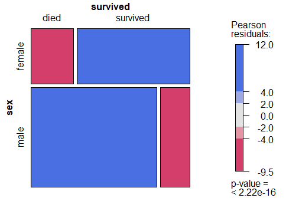
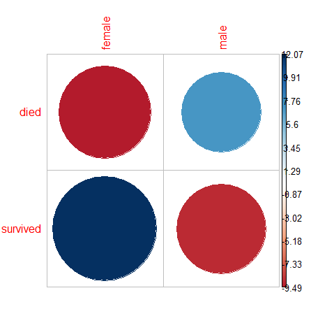
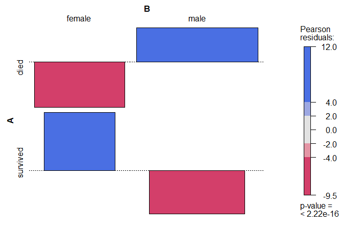
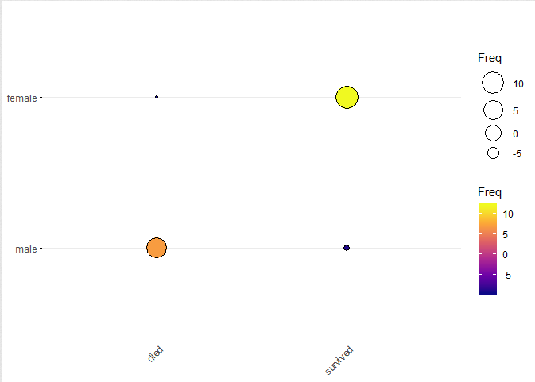
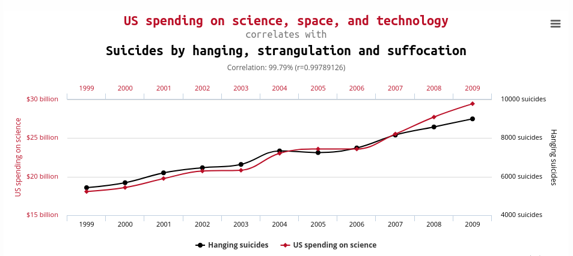
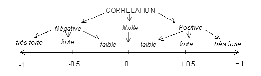
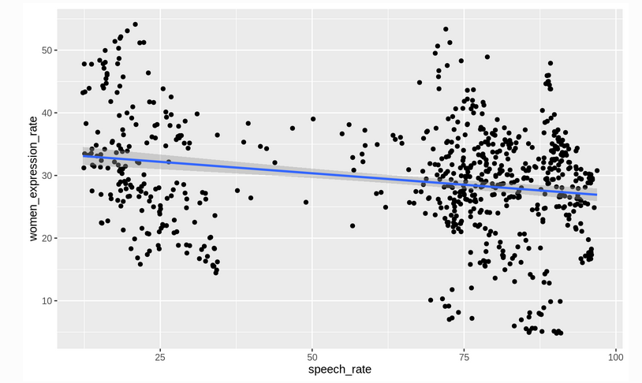
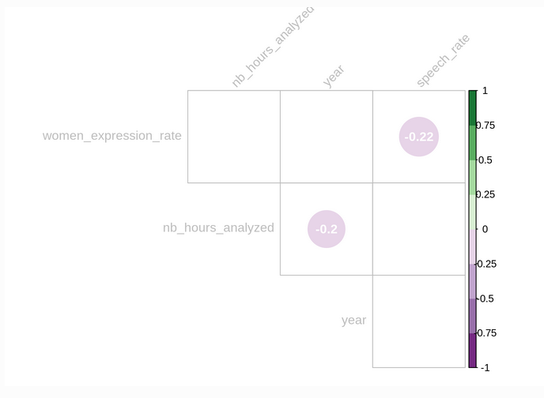
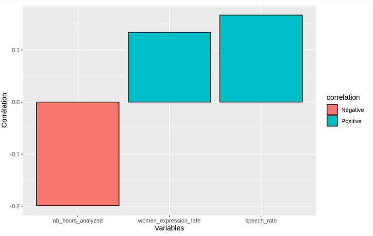
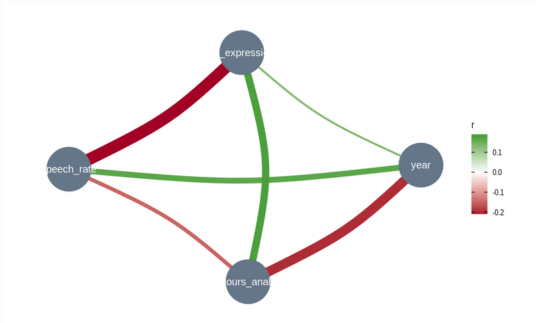

## Nos objectifs

::: r-stack
{width="500"}
:::

::: {style="font-size: 0.85em;margin-top:20px;"}
**Avant tout ne pas vous dégoûter des stats !**
:::

 

::: {style="font-size: 0.85em;margin-top:15px;color:#3498db;"}
[**En bref, à l'issue du cours vous ne serez pas des experts, mais vous aurez quelque armes pour démarrer l'exploration de vos données !**]{style="color:#e74c3c;"}
:::

## Nos objectifs II

::: {style="font-size: 0.8em;margin-top:15px;"}
À part ça :

1.  Vous montrez l'intérêt des statistiques exploratoires
2.  Vous aidez à réaliser vos premiers pas en base de données
3.  Vous enseignez les premiers indicateurs statistiques utiles pour l'exploration des données
4.  Vous montrer les différents mondes de la statistiques et leurs outils
5.  (Représenter graphiquement vos données)
:::

## Un peu d'histoire...

::: r-stack
{width="400" style="margin-top:10px; margin-bottom:0px"}
:::

::: {style="font-size: 0.8em;margin-top:20px;"}
La statistique est à l'origine réalisée surtout par les états dans des objectifs de dénombrement, d'inventaire et de recensement pour des besoins avant tout **militaire et bien sur économique**.

> Le mot statistique est d'ailleurs d'origine latine et vient de status qui signifie Etat.
:::

::: notes
Parmi les plus vieilles traces de recensements on peut remonter jusqu'à l'époque sumérienne entre 3000 et 5000 av. JC.

Sur ce sujet précis les anecdotes varient, on entend aussi qu'on retrouverait les premières traces de statistiques en Chine.
:::

## Encore quelques repères historiques.

::: {style="font-size: 0.8em;margin-top:20px;"}
A la renaissance (aux alentours du 17ème siècle) on va parler de **l'arithmétique politique** qui constitue la base de la statistique moderne.

> L'arithmétique politique correspond à l'ensemble des *"opérations qui ont pour but des recherches utiles à l'art de gouverner" Diderot*. Par ex : le nombre d'hommes habitant le pays, le nombre de naufrages sur tel route maritime...
:::

 

::: {style="font-size: 0.7em;margin-top:15px;"}
C'est au 19ème siècle que les statistiques vont prendre leur essor avec le développement de méthodes et de lois statistiques notamment grâce à des mathématiciens comme Laplace, Gauss, Pearson, Poisson...
:::

::: notes
C'est seulement au 20ème siècle que les statistiques deviennent une science à part entière et autonome.

Aujourd'hui avec la profusion des données et du le big data, la statistique a pris un rôle capital. Et le statisticien est devenu le data scientist !
:::

## Qu'est-ce que la statistique ?

::: r-stack
{width="700" style="margin-top:10px; margin-bottom:0px"}
:::

::: {style="font-size: 0.6em;margin-top:20px;"}
Principe 1 : **Tout peut être quantifier**
:::

::: {style="font-size: 0.6em;margin-top:20px;"}
Principe 2 : **Toujours il existe de la variation aussi minime soit-elle.**
:::

::: {style="font-size: 0.6em;margin-top:20px;"}
Principe 3 : **Il existe quasiment toujours des mécanismes généraux qui permettent d’analyser et d’expliquer la variation.**
:::

::: {style="font-size: 0.6em;margin-top:0px;color:#3498db;"}
**La statistique est donc l’étude quantifiée de cette variation.**
:::

::: {style="font-size: 0.6em;margin-top:0px;color:#3498db;"}
La statistique c'est un ensemble d'outils dont le but est de nous permettre de **décrire et d'analyser des phénomènes observés**
:::

::: notes
Elle permet ausi entre autre :

-   De créer une information systématique qui permet donc la comparaison.
-   De traiter et analyser l'information : étudier le lien entre les observations, la cause...
-   De résumer et représenter l'information : faire des tableaux croisés, des graphiques...
-   De vérifier la fiabilité de l'information : notamment en cas de sondage.
-   De permettre le premier pas de la réutilisation de l'information dans le but d'une application.

En revanche la statistique **ne permet pas** de remplacer le raisonnement explicatif ou la connaissance et l'expertise du phénomène étudié. **Elle ne remplace pas tout simplement l'esprit critique**.
:::

## Statistique et image I

::: {style="font-size: 0.8em;margin-top:20px;"}
Très souvent l'image que l'on se fait de la statistique ressemble à ça ...
:::

{width="80%" fig-align="center"}

## Statistique et image II

::: {style="font-size: 0.8em;margin-top:20px;color:#e74c3c;"}
Il ne faut pas oublier que le but premier de la statistique est **d'éclairer et aider à interpréter des phénomènes observables et mesurables**.
:::

::: {style="font-size: 0.8em;margin-top:5px;"}
C'est pourquoi la statistique est aussi liée à l'image et à la représentation graphique.

La statistique c'est donc bien sur des formules mais aussi la traduction et la représentation en image.
:::

::: r-stack
{width="700"}
:::

##  {background-image="images/playfair.png" background-size="70%"}

::: {style="position: absolute; bottom: 50px; left: 50px; right: 50px; background-color: rgba(0,0,0,0.7); padding: 20px; border-radius: 10px;"}
William Playfair qui illustre en 1786 l'évolution de la dette publique britanique au cours du 18ème siècle.
:::

##  {background-image="images/Nightingale.jpg" background-size="70%"}

::: {style="position: absolute; bottom: 50px; left: 50px; right: 50px; background-color: rgba(0,0,0,0.7); padding: 20px; border-radius: 10px;"}
Florence Nightingale en 1859 sur les causes de la mortalité saisonnière des soldats anglais au sein de son hopital militaire.
:::

##  {background-image="images/minard.png" background-size="70%"}

::: {style="position: absolute; bottom: 50px; left: 50px; right: 50px; background-color: rgba(0,0,0,0.7); padding: 20px; border-radius: 10px;"}
Robert Minard en 1869 sur la mortalité de l'armée de Napoléon lors de la retraite de Russie
:::

##  {background-image="images/kaupp.jpeg" background-size="70%"}

::: {style="position: absolute; bottom: 50px; left: 50px; right: 50px; background-color: rgba(0,0,0,0.7); padding: 20px; border-radius: 10px;"}
Et cela se poursuit bien sur aujourd'hui ! Jake Kaupp sur les colisions d'oiseaux
:::

##  {background-image="images/bigmac.jpeg" background-size="70%"}

::: {style="position: absolute; bottom: 50px; left: 50px; right: 50px; background-color: rgba(0,0,0,0.7); padding: 20px; border-radius: 10px;"}
Christophe Nicault sur l'indice Big Mac
:::

##  {background-image="images/ramen.jpeg" background-size="60%"}

::: {style="position: absolute; bottom: 50px; left: 50px; right: 50px; background-color: rgba(0,0,0,0.7); padding: 20px; border-radius: 10px;"}
Georgios Karamanis sur les restaurants de Ramen
:::

## Au commencement de la statistique...La donnée

{width="700" style="margin-top:10px; margin-bottom:0px"}

::: {style="font-size: 0.8em;margin-top:20px;"}
La donnée est au coeur et au commencement de l'analyse statistique !
:::

## Qu'est ce que la donnée en statistique

::: {style="font-size: 0.8em;margin-top:10px;"}
Une multitude de travaux ont donc tenté de donner une définition (plus ou moins claire) de la donnée.
:::

 

::: {style="font-size: 0.8em;margin-top:10px;"}
Peu importe la définition il faut retenir que la donnée en statistique n’existe pas dans la nature de façon imanente.
:::

 

::: {style="font-size: 0.6em;margin-top:10px;"}
Les données ne sont pas données, il faut les construire, les prendre!

> Elles requièrent en amont un travail de modélisation, d’abstraction, de spécification des concepts, puis des domaines, avant d’imaginer produire des valeurs. Elles sont dépendantes de choix eux-mêmes liés à des usages.
:::

## Statistique et données

::: {style="font-size: 0.8em;margin-top:20px;"}
[**Rappel: le but de la statistique est donc d'analyser des phénomènes observés.**]{style="color:#4178bc;"}
:::

::: {style="font-size: 0.8em;margin-top:20px;"}
1 - Le premier enjeu de la statistique c'est l'observation du ou des phénomènes que l'on souhaite analyser et comprendre.
:::

::: {style="font-size: 0.8em;margin-top:20px;"}
2 - Vient ensuite l'enjeu la mise en forme de ces observations. C'est à dire la traduction des observations sous une forme qui les rends interpretable, analysable et rend possible l'usage de la statistique. \> C'est la création de la **base de données**.
:::

## Les variables quantitatives

::: {style="font-size: 0.8em;margin-top:20px;"}
Une variable quantitative permet de mesurer une **grandeur, une quantité**.
:::

 

::: {style="font-size: 0.8em;margin-top:10px;"}
Elle va avoir une forme numérique, et on va pouvoir calculer une somme, une différence, une moyenne...
:::

 

::: {style="font-size: 0.6em;margin-top:10px;"}
Une variable quantitative peut elle même appartenir à deux catégories différentes:

-   **discrète** : elle correspond alors à un nombre fini de valeurs possibles. Exemple : un nombre de logements, d'enfants, un âge...

-   **continue** : correspond à priori, toutes les valeurs possibles. Exemple : une taille, une surface, un salaire, ...
:::

## Les variables qualitatives

::: {style="font-size: 0.6em;margin-top:20px;"}
Une variable qualitative indique des **caractéristiques qui ne sont pas des quantités**. Les différentes valeurs que peut prendre cette variable sont appelées les **catégories** ou **modalités**.
:::

::: {style="font-size: 0.6em;margin-top:10px;"}
Elle peut être :

-   **ordonnée** : elle va exprimer un ordre. Exemple : “un peu - beaucoup - passionément”
-   **non ordonnée** : elle va exprimer l'appartenance à différents groupe Exemple : une couleur, un groupe sanguin…
:::

::: {style="font-size: 0.6em;margin-top:10px;"}
Une variable qualitative ne permet pas de faire des calculs.

> La moyenne d’un groupe sanguin n’a aucun sens.

En revanche, on pourra faire des tableaux de fréquence.

> Combien de personnes sont A+, B-...
:::

## Quelle forme pour nos données ?

::: notes
Si nous avons vu les différents types de données, il faut désormais la "ranger", l'"organiser" de manière à les rendre analysable. C'est lors de cette étape que nous allons construire notre **base de données**.
:::

::: {style="font-size: 0.6em;margin-top:20px;"}
La base de donnée est l'organisation de nos données qui va nous permettre de les rendre traitable par la statistique.
:::

{width="50%" fig-align="center"}

::: {style="font-size: 0.6em;margin-top:10px;"}
Par défaut une base de donnée statistique repose sur trois règles interdépendantes :

1- chaque ligne correspond à une observation

2- chaque colonne correspond à une variable

3- chaque valeur est présente dans une unique case de la table
:::

::: {style="font-size: 0.5em; background-color:#B3E5FC; padding:20px; border-radius:10px; margin-top:30px; border-left:5px solid #03A9F4;"}
Ces régles ne sont pas absolu, tout dépendra bien sur de ce que vous voudrez faire. Ces régles fonctionne pour de l'analyse et la représentation statitique mais la cartographie ou l'analyse de réseau pourra demander un autre format...
:::

## Petit dictionnaire non exhaustif

::: {style="font-size: 0.6em;margin-top:20px;"}
[**La population**]{style="color:#3498db;"} : c'est l'ensemble fini ou non d'individus, d'objets ou d'observations sur lesquels porte notre analyse statistique.

> Exemple : Si on fait une étude sur l'âge des inscrits au Master GTDD l'année 2025, la population c'est l'ensemble des 36 inscrits

[**L'échantillon**]{style="color:#3498db;"} : c'est un sous-ensemble de cette population. L'objectif d'un échantillon est de pouvoir estimer des caractéristiques de la population générale.

> Exemple : Interroger 10 étudiants sur les 36 inscrits au Master GTDD l'année 2025.
:::

 

::: {style="font-size: 0.6em;margin-top:20px;"}
[**L'unité statistique**]{style="color:#3498db;"} (ou individu statistique) : c'est l'élément qui compose notre population (ou échantillon). Cette unité peut être humaine (un habitant, un agriculteur...) ou non (une entreprise, une commune, une parcelle...)

> Exemple : Chaque étudiant ou étudiante inscrit au Master GTDD l'année 2024.

 

[**N**]{style="color:#3498db;"} ou [**n**]{style="color:#3498db;"} : c'est le nombre d'individus statistiques dans notre population ou échantillon, on parle aussi d'effectif ou de taille.

> Exemple : 36 étudiants inscrits au Master GTDD l'année 2025, donc N=36.
:::

::: {style="font-size: 0.6em;margin-top:20px;"}
[**La variable**]{style="color:#3498db;"} (ou caractère - bcp moins fréquent) : c'est une caractéristique de notre unité statistique. Evidemment une unité statistique peut se décrire à travers de nombreuses variables.

> Exemple : l'âge des étudiants, le sexe, la formation d'origine, l'obtention d'un stage, le nombre de projets tuteurés sur l'année, le salaire après 3 ans...

 

[**La modalité**]{style="color:#3498db;"} : correspond au résultat de l'observation d'une variable chez une ou plusieurs unité(s) statistique(s).

> Exemple : 25 ans ; 22 ans / féminin ; masculin ; autre / géographie ; biologie ; géologie / oui ; non / 1 projet ; 2 projets...
:::

 

::: {style="font-size: 0.6em;margin-top:15px;background-color:#9b59b6;padding:15px;border-radius:5px;"}
Il n'y a pas de modalité possible sans la connaissance de la variable !
:::

::: {style="font-size: 0.6em;margin-top:20px;"}
[**L'effectif**]{style="color:#3498db;"} est le nombre d'observations d'une même modalité. On le note souvent [**ni**]{style="color:#3498db;"} ou [**fi**]{style="color:#3498db;"}.
:::

 

::: {style="font-size: 0.8em;margin-top:15px;"}
[**L'effectif total**]{style="color:#3498db;"} est égale à la somme des effectifs de toutes les modalités qui peuvent être prises par la variable.
:::

::: {style="font-size: 0.6em;margin-top:20px;"}
[**La fréquence**]{style="color:#3498db;"} est égale au rapport entre l'effectif de la modalité et l'effectif total. Elle est donc comprise entre 0 et 1 (ou entre 0% et 100%).
:::

::: {style="font-size: 0.6em;margin-top:15px;background-color:#9b59b6;padding:15px;border-radius:5px;"}
Fréquence d'une modalité = effectif de cette modalité / effectif total

 

**La somme des fréquences est toujours égale à 1.**
:::

::: {style="font-size: 0.6em;margin-top:20px;"}
[**L'effectif cumulé croissant d'une modalité**]{style="color:#3498db;"} est le nombre d'unités statistiques qui possèdent la modalité considérée ou une modalité inférieure à celle-ci (dans l'ordre des modalités).
:::

 

::: {style="font-size: 0.6em;margin-top:15px;"}
[**La fréquence cumulée croissante d'une modalité**]{style="color:#3498db;"} est le rapport entre l'effectif cumulé de la modalité et l'effectif total.
:::

::: {style="font-size: 0.6em;margin-top:15px;background-color:#9b59b6;padding:15px;border-radius:5px;"}
**Important :** Les effectifs et fréquences cumulés ne peuvent être calculés que pour les variables quantitatives ou les variables qualitatives ordinales.
:::

## Statistiques et esprit critique

{width="700" fig-align="center" style="margin-top:10px; margin-bottom:0px;"}

## Statistique = Bullshit ?!

::: {style="font-size: 0.75em;margin-top:20px;" fig-align="center"}
Et bien ce n'est pas entièrement faux! Mais cela vient d'une confusion très importante.

C'est la confusion entre [**LA**]{style="color:#3498db;"} Statistique et [**LES**]{style="color:#3498db;"} statistiques.
:::

 

::: {style="font-size: 0.75em;margin-top:20px;"}
[**LA Statistique**]{style="color:#3498db;"} renvoie à l'ensemble des méthode et outils de cette discipline qui permet de produire et analyser de l'information. Bien utilisé c'est absolument rigoureux et peut être considérée comme une base de la pensée scientifique.
:::

 

::: {style="font-size: 0.75em;margin-top:20px;"}
[**LES statistiques**]{style="color:#3498db;"} ou [**données statistiques**]{style="color:#3498db;"} ne sont que les résultats des méthodes utilisées. Résultats qui peuvent donc être faux, mal interprétés ou carrément devoyés pour servir un argumentaire particulier.
:::

## La variation relative et la variation absolue I

::: {style="font-size: 0.6em;margin-top:20px;" fig-align="center"}
**La dette de la France avait augmenté de 15% l'année dernière, cette année elle n'a augmenté que de 14% !**
:::

 

::: {style="font-size: 0.6em;margin-top:20px;"}
-Dette de départ : $100 M€$     - Déficit 1ère année : **15 % \* 100= 15M€** ⇒ La dette est donc de $115M€$     - Déficit 2ème année : **14 % × 115 = 16.1M€** ⇒ La dette a connu une plus grosse augmentation que l'année d'avant
:::

 

::: {style="font-size: 0.6em;margin-top:20px;" fig-align="center"}
*« Il y a trois sortes de mensonges : les mensonges, les sacrés mensonges et les statistiques » – Mark Twain.*
:::

## La variation relative et la variation absolue II

::: {style="font-size: 0.6em;margin-top:20px;" fig-align="center"}
**Les dirigeants d'une entreprise affirment que le salaire mensuel moyen est passé de 2181€ à 2618€, soit une augmentation de 20%.**   **Les syndicat de la même entreprise affirme que les ouvriers comme les cadres de l'entreprise ont connus une baisse de 10% de leur salaire moyen.**

[**Qui a raison ?**]{style="color:#3498db;"}
:::

{width="70%" fig-align="center" style="margin-top:10px; margin-bottom:0px;"}

## La variation relative et la variation absolue III

::: {style="font-size: 0.6em;margin-top:20px;" fig-align="center"}
Les syndicats : $$\left\{
 \begin{array}{ll}
\mbox{2000 -> 1800} \\
\mbox{4000 -> 3600}
\end{array}
\right\}= \mbox{Baisse de 10%}$$
:::

::: {style="font-size: 0.6em;margin-top:20px;" fig-align="center"}
Les dirigeants de l'entreprise : $$\left\{
 \begin{array}{ll}
 \frac{(2000*1000)+(4000*100)}{1000}=2181€ \\
 \frac{(1800*600)+(3600*500)}{1000}=2618€
 \end{array}
 \right\}= \mbox{Augmentation de 20%}$$
:::

::: {style="font-size: 0.8em;margin-top:20px;"}
**Evolution du salaire moyen ≠ évolution moyenne du salaire**
:::

 

::: {style="font-size: 0.6em;margin-top:20px;" fig-align="center"}
*« Les statistiques ont une particularité majeure : elles ne sont jamais les mêmes selon qu’elles sont avancées par un homme de gauche ou par un homme de droite » – Jacques Maillot.*
:::

## Les choix de réprésentation

::: {style="font-size: 0.6em;margin-top:20px;"}
Outre les biais liées à la perception visuelle qui doivent amener à réfléchir à comment représenter la données :
:::

{width="700" fig-align="center" style="margin-top:10px; margin-bottom:0px;"}

::: {style="font-size: 0.6em;margin-top:20px;"}
Le choix de représentation de la donnée statistique peut entrainer une interprétation différente.
:::

##  {background-image="images/impeach.png" background-size="80%"}

::: {style="position: absolute; bottom: 50px; left: 50px; right: 50px; background-color: rgba(0,0,0,0.7); padding: 20px; border-radius: 10px;"}
Trump pour critiquer la procédure de destitution lors de son premier mandat
:::

##  {background-image="images/impeach_02.png" background-size="80%"}

::: {style="position: absolute; bottom: 50px; left: 50px; right: 50px; background-color: rgba(0,0,0,0.7); padding: 20px; border-radius: 10px;"}
La réponse des pro-destitution
:::

##  {background-image="images/sharksbook.png" background-size="90%"}

## Les échelles I

::: {style="font-size: 0.8em;margin-top:20px;"}
Les échelles à laquelle nous nous situons peu également poser problème dans l'interprétations des chiffres sans que ces derniers soit faux.
:::

 

::: {style="font-size: 0.8em;margin-top:20px;"}
Par exemple la fraude sociale correspondrait à environ 300 millions d'€ et la fraude fiscale à 13 milliard d'€.
:::

 

::: {style="font-size: 0.8em;margin-top:20px;"}
**Notre cerveau a du mal à jongler avec de tels chiffres et à appréhender clairement la différence entre million et milliard!**

On perçoit bien que la fraude fiscale est plus importante mais il est difficile d'appréhender l'ampleur de la différence.
:::

## Les échelles II

::: {style="font-size: 0.8em;margin-top:20px;" fig-align="center"}
[**Une des solutions le changement d'échelle!**]{style="color:#3498db;"}
:::

::: {style="font-size: 0.8em;margin-top:20px;"}
Des millions/milliard d'euros c'est tellement énorme que j'ai du mal à me représenter ce que ça représente et les comparer. **Si on convertie en seconde ?**

1 million de seconde c'est quoi ? A peu près 11 jours.

 

=\> Donc la fraude sociale représente à peu près 300 fois 11 jours soit environ 9 ans

1 milliard de seconde c'est quoi ? A peu prés 31 ans.

=\> Donc la fraude fiscale représente 13 fois 31 ans soit 403 ans

 

**9 ans Versus 403 ans, la perception de l'écart devient plus clair !**
:::

## Le paradoxe de Simpson I

::: {style="font-size: 0.8em;margin-top:20px;"}
C'est un paradoxe assez connu et très contre-intuitif qu'il est absolument nécessaire de connaitre quand on travaille sur la donnée et la statistique.   Pour le présenter commençons par un exemple :
:::

::: {style="font-size: 0.7em;margin-top:20px;"}
**Chez les femmes non-fumer tue!**   Une étude suit 1314 femmes pendant 20 ans, l’objectif est de comparer le taux de mortalité des fumeuses et des non-fumeuses. Après 20 ans, le taux de mortalité chez les fumeuses était de 24%, alors que celui des non-fumeuses était 31%.   Est-ce que ne pas fumer tue ?

Dans l’étude, il y avait 582 fumeuses et 139 sont mortes (cela fait bien 24%), ainsi que 732 non-fumeuses dont 230 sont mortes (31%, pas de problème).
:::

::: {style="font-size: 0.7em;margin-top:20px;"}
**Là où le paysage change, c’est quand on représente ces chiffres en séparant par classe d’âge.**
:::

## Le paradoxe de Simpson II

::: {style="font-size: 0.6em;margin-top:20px;"}
Si on raisonne par classe d’âge, dans chaque tranche la mortalité chez les fumeuses a été supérieure à celle des non-fumeuses.   Dans la population initiale, il y avait plus de femmes âgées chez les non-fumeuses que chez les fumeuses. Et même si dans chaque tranche d’âge les non-fumeuses meurent moins, cet effet est compensé par le fait que la tranche d’âge « élevée » est sur-représentée chez les non-fumeuses…qui donc en moyenne meurent plus!
:::

## Le paradoxe de Simpson III

::: {style="font-size: 0.8em;margin-top:20px;"}
**Le paradoxe de Simpson c'est quand une corrélation, un lien peut disparaître ou même s’inverser suivant que l’on considère les données dans leur ensemble, ou bien segmentées par groupes.**
:::

::: {style="font-size: 0.8em;margin-top:20px;"}
Pour que le paradoxe se produise, il faut 2 ingrédients :

-   Premièrement il faut une variable qui influe sur le résultat final (le « groupe »), et qui n’est pas forcément explicitée au départ. On appelle cela un facteur de confusion. \> Il s’agit de l’âge des personnes dans notre exemple, lequel évidemment joue sur la mortalité.

-   Deuxièmement, il faut que l’échantillon qu’on étudie ne soit pas distribué de manière homogène. \> Dans le cas du tabac, il y a plus de vieilles femmes dans l’échantillon des non-fumeuses que chez les fumeuses.
:::

## Le paradoxe de Simpson IV

::: {style="font-size: 0.8em;margin-top:20px;" fig-align="center"}
**Ainsi le potentiel de manipulation qui se cache derrière ce paradoxe est énorme !**
:::

 

::: {style="font-size: 0.8em;margin-top:20px;"}
On peut vous faire croire à quelque chose (le chômage a baissé, tel traitement marche mieux, tel individu est meilleur, etc.) alors qu’en regardant les chiffres dans le détail, les effets peuvent disparaître ou s’inverser !
:::

## Le biais d'échantillonnage

::: {style="font-size: 0.65em; margin-top:20px;"}
**Qu'est-ce que c'est ?**

Le biais d'échantillonnage se produit quand votre échantillon ne représente pas fidèlement votre population cible. Certains groupes sont sur-représentés ou sous-représentés.
:::

{width="50%" fig-align="center" style="margin-top:10px; margin-bottom:0px;"}

## Le biais d'échantillonnage II

::: {style="font-size: 0.6em; margin-top:0px;"}
Les méfaits des fluctuations d ’échantillonnage.

-   A : Deux échantillons, même fort différents, ne proviennent pas nécessairement de deux populations différentes.

-   B : Deux échantillons, même fort semblables, ne proviennent pas nécessairement de deux populations semblables.

**Exemple concret :**Si vous voulez connaître l'opinion des Français sur un sujet en interrogeant uniquement des personnes dans un centre commercial un mardi à 14h, potentiellement on peut manquer :

-   Les personnes qui travaillent
-   Les habitants des zones rurales
-   etc...
:::

::: {style="background-color:#FFE0B2; padding:15px; border-radius:8px; border-left:5px solid #FF9800; font-size:0.7em;"}
**Conséquence :** Vos résultats seront biaisés et vos conclusions ne pourront pas être généralisées à toute la population.
:::

## Types de biais d'échantillonnage courants

::::::::: columns
::::: {.column width="50%"}
::: {style="font-size: 0.75em;"}
**1. Biais de sélection**

Certaines personnes ont plus de chances d'être choisies.

*Exemple :* Sondage téléphonique sur ligne fixe
:::

 

::: {style="font-size: 0.75em;"}
**2. Biais de non-réponse**

Certains groupes refusent plus de participer.

*Exemple :* Les mécontents répondent plus aux enquêtes de satisfaction
:::
:::::

::::: {.column width="50%"}
::: {style="font-size: 0.75em;"}
**3. Biais de volontariat**

Seuls les volontaires participent.

*Exemple :* Étude sur le sport : attire plus les sportifs
:::

 

::: {style="font-size: 0.75em;"}
**4. Biais de commodité**

On interroge les personnes faciles d'accès.

*Exemple :* Enquête uniquement dans votre université : science WEIRD
:::
:::::
:::::::::

## Les pourvoyeurs de données

{width="60%" fig-align="center" style="margin-top:10px; margin-bottom:0px;"}

::: {style="font-size: 0.6em; margin-top:0px;"}
La donnée représente un enjeu essentiel. Mais comment se la procurer quand il est trop couteux de la produire ?
:::

::: {style="font-size: 0.6em; margin-top:0px;"}
De très nombreux acteurs tant publiques (INSEE, université...) que privées (instituts de sondage, entreprises..) ont pour vocation à la fois de la produire, stocker et diffuser/vendre la donnée.

> Il est alors essentiel de comprendre qui a fourni la donnée étudiée pour déjà se faire une idée de comment elle a été construite.   L'INSEE et l'institut de sondage IPSOS n'ont pas la même missions et les mêmes objectifs.
:::

## Statistique publique I

::: {style="font-size: 0.6em; margin-top:0px;"}
En France les services de statistiques sont organisés autour de l'INSEE.   Il existe ensuite des services statistiques ministériels qui exercent des missions plus précises en lien avec leur ministère.

> Leur création, organisation et prérogatives sont extrêmement encadré par notamment la loi de 1951 qui a connu plusieurs évolution depuis.

 

Ces services ne sont pas une spécificité française, et ils existent aussi au sein d'organisation internationalles tel que l'Union Européene ou l'ONU.
:::

## Statistique publique II

::: {style="font-size: 0.8em; margin-top:0px;"}
Attention il ne faut pas confondre les services de statistique publique et la statistique publique dont la définition en France et en Europe est inscrite dans la loi :

> La statistique publique c'est *l’ensemble des productions issues d’une part des enquêtes statistiques et, d’autre part, de l’exploitation, à des fins d’information générale, de données collectées par des administrations, des organismes publics ou des organismes privés chargés d’une mission de service public.*
:::

 

::: {style="background-color:#FFE0B2; padding:15px; border-radius:8px; border-left:5px solid #FF9800; font-size:0.6em;"}
Par exemple le nombre de personne présente au festival de vieilles charrues cet été fourni par les organisateurs rentre dans le champs de la statistique publique au même titre que le recensement fait par l'INSEE.
:::

## Statistique publique III

::: {style="font-size: 0.6em; margin-top:0px;"}
Attention si en France la récolte de la donnée, leur mise à disposition sont strictement encadrées par la loi et dont les bonnes pratiques sont vérifiées par des conseils et autorités supérieures. Ce n'est pas toujours le cas.

 

Il est donc indispensables de savoir d'où viennent les informations récupérées et comment elles l'ont été.

 

Voici un liste non exhaustive de sources fiables sur lesquelles vous pouvez vous reposer afin de trouver des ressources et des données.
:::

:::: {.column width="50%"}
::: {style="font-size: 0.6em;"}
En France :

-   [**INSEE**](https://www.insee.fr/fr/accueil)
-   [**Etalab**](https://www.etalab.gouv.fr/)
-   [**data.gouv**](https://www.data.gouv.fr/fr/)
:::
::::

:::: {.column width="50%"}
::: {style="font-size: 0.6em;"}
En Europe :

-   [**Eurostat**](https://ec.europa.eu/eurostat/fr/)

 

Dans le monde :

-   [**United nations statistic division**](https://unstats.un.org/home/)\]
:::
::::

## Statistique univariée

::: {style="font-size: 0.8em;margin-top:20px;"}
On parle de statistiques univariées lorsque l'on étudie **un seul** caractère. Cette étape est essentielle et très souvent les premiers pas d'une analyse de données.

On va donc étudier les indicateurs statistiques qui vont nous permettre de :

-   **Mieux visualiser nos données**
-   **Résumer nos données :** à travers les statistiques de position et de dispersion.
:::

## Les statistiques de position I

::: {style="font-size: 0.8em;margin-top:20px;"}
Les statistiques de position correspondent à des valeurs qui sont situées dans une zone particulière des modalités de notre variable quantitative.

Les statistiques de position font partie intégrante de ce que l'on peut appeler les indicateurs de tendance centrale, à savoir les indicateurs qui vont nous permettre de caractériser l'ordre de grandeur représentatif de notre série de valeurs.
:::

 

::: {style="font-size: 0.8em;margin-top:15px;color:#3498db;"}
[**On peut distinguer deux types de statistiques de position :**]{style="font-weight:bold;"}

1.  Les modes
2.  Les valeurs centrales : la médiane, la moyenne, les quartiles, les quantiles
:::

## Les statistiques de position II

::: {style="font-size: 0.8em;margin-top:20px;"}
[**Le mode (ou classe modale)**]{style="color:#3498db;"} est l'indicateur le plus simple, c'est la modalité qui possède le plus grand effectif. Une distribution peut avoir plusieurs modes.

> *Exemple :* Dans la série suivante : 3, 4, 4, 5, 6, 7, 9, 10, 10, 10 ; Le mode est 10
:::

 

::: {style="font-size: 0.8em;margin-top:15px;"}
[**La moyenne**]{style="color:#3498db;"} (ou moyenne arithmétique) est la valeur qui nous permettrait d'obtenir le même total si toutes nos valeurs étaient identiques.
:::

{width="80%" fig-align="center"}

::: {style="font-size: 0.7em;margin-top:10px;"}
Attention : La moyenne est très sensible aux valeurs extrêmes !
:::

## Les statistiques de position III

::: {style="font-size: 0.8em;margin-top:20px;"}
[**La médiane**]{style="color:#3498db;"} est une valeur qui coupe notre série ordonnée en deux sous-séries de même effectif.
:::

 

::: {style="font-size: 0.8em;margin-top:15px;"}
Si notre série de valeurs contient un [**nombre impair de valeurs**]{style="color:#e74c3c;"}, la médiane est la valeur centrale de cette série.

> *Exemple :* 2, 3, 4, 5, 5, 8, 10, 10, 15, 20, 26 ; La médiane vaut 8

 

Si notre série de valeurs contient un [**nombre pair de valeurs**]{style="color:#e74c3c;"}, la médiane est la moyenne des deux valeurs centrales.

> *Exemple :* 2, 3, 4, 5, 5, 10, 10, 15, 20, 26 ; La médiane vaut (5+10)/2 = 7,5
:::

## Les statistiques de position IV

::: {style="font-size: 0.8em;margin-top:20px;"}
[**Les quartiles**]{style="color:#3498db;"} vont permettre de diviser notre série de valeurs ordonnées en quatre parties égales.
:::

 

::: {style="font-size: 0.8em;margin-top:15px;"}
-   [**Q1 (premier quartile)**]{style="color:#3498db;"} : coupe notre série ordonnée en deux sous-séries de 25% et de 75% de l'effectif total

-   [**Q2 (deuxième quartile)**]{style="color:#3498db;"} : coupe notre série ordonnée en deux sous-séries de 50% = la médiane

-   [**Q3 (troisième quartile)**]{style="color:#3498db;"} : coupe notre série ordonnée en deux sous-séries de 75% et de 25% de l'effectif total
:::

 

::: {style="font-size: 0.7em;margin-top:15px;background-color:#3498db;padding:15px;border-radius:5px;"}
Q1 correspond à la première valeur de notre série qui possède une fréquence cumulée supérieure ou égale à 0,25 (ou 25%) Q3 correspond à la première valeur de notre série qui possède une fréquence cumulée supérieure ou égale à 0,75 (ou 75%)
:::

## Les statistiques de position V

::: {style="font-size: 0.8em;margin-top:20px;"}
[**Les déciles (ou quantiles)**]{style="color:#3498db;"} vont permettre de diviser notre série de valeurs ordonnées en dix parties égales.
:::

 

::: {style="font-size: 0.8em;margin-top:15px;"}
-   [**D1 (premier décile)**]{style="color:#3498db;"} : correspond au premier dixième (10%) de notre série ordonnée

-   [**D5 (cinquième décile)**]{style="color:#3498db;"} : correspond au cinquième dixième (50%) = la médiane = Q2

-   [**D9 (neuvième décile)**]{style="color:#3498db;"} : correspond au neuvième dixième (90%) de notre série ordonnée
:::

 

::: {style="font-size: 0.7em;margin-top:15px;background-color:#3498db;padding:15px;border-radius:5px;"}
D1 correspond à la première valeur de notre série qui possède une fréquence cumulée supérieure ou égale à 0,1 (ou 10%) D9 correspond à la première valeur de notre série qui possède une fréquence cumulée supérieure ou égale à 0,9 (ou 90%)
:::

## Exemple pratique de position

::: {style="font-size: 0.8em;margin-top:20px;"}
Prenons l'exemple de l'âge de 15 personnes : 20, 21, 22, 23, 25, 27, 29, 30, 32, 33, 35, 40, 42, 48, 50
:::

 

::: {style="font-size: 0.8em;margin-top:15px;"}
-   **Mode :** Aucun (toutes les valeurs sont uniques)
-   **Moyenne :** (20+21+22+23+25+27+29+30+32+33+35+40+42+48+50)/15 = 31,8 ans
-   **Médiane :** 30 ans (8ème valeur)
-   **Q1 :** 23 ans (4ème valeur, 25% de 15 = 3,75 ≈ 4)
-   **Q3 :** 40 ans (12ème valeur, 75% de 15 = 11,25 ≈ 12)
-   **D1 :** 21 ans (2ème valeur, 10% de 15 = 1,5 ≈ 2)
-   **D9 :** 48 ans (14ème valeur, 90% de 15 = 13,5 ≈ 14)
:::

## Les statistiques de dispersion I

::: {style="font-size: 0.8em;margin-top:20px;"}
Les statistiques de dispersion vont nous permettre de connaître la variabilité et l'homogénéité de nos données, c'est-à-dire de savoir si les valeurs de notre série statistique sont regroupées ou étalées.
:::

 

::: {style="font-size: 0.8em;margin-top:15px;color:#3498db;"}
[**Principaux indicateurs de dispersion :**]{style="font-weight:bold;"}

1.  L'étendue
2.  L'intervalle interquartile (IQR)
3.  La variance
4.  L'écart-type
5.  Le coefficient de variation
:::

## Les statistiques de dispersion II

::: {style="font-size: 0.8em;margin-top:20px;"}
[**L'étendue (ou amplitude)**]{style="color:#3498db;"} est simplement la différence entre la valeur maximale et la valeur minimale de notre série.

> *Exemple :* Pour la série 3, 4, 5, 6, 7, 10, 15, 20 ; L'étendue = 20 - 3 = 17
:::

 

::: {style="font-size: 0.8em;margin-top:15px;"}
[**L'intervalle interquartile (IQR)**]{style="color:#3498db;"} est la différence entre le troisième quartile (Q3) et le premier quartile (Q1). Il contient 50% des observations.

> IQR = Q3 - Q1

L'IQR est très utile pour détecter les valeurs aberrantes (outliers) : - Limite basse = Q1 - 1,5 × IQR - Limite haute = Q3 + 1,5 × IQR
:::

## Les statistiques de dispersion III

::: {style="font-size: 0.8em;margin-top:20px;"}
[**La variance**]{style="color:#3498db;"} mesure la dispersion des valeurs autour de la moyenne. Elle correspond à la moyenne des carrés des écarts à la moyenne.
:::

{width="80%" fig-align="center"}

 

::: {style="font-size: 0.8em;margin-top:15px;"}
[**L'écart-type**]{style="color:#3498db;"} est la racine carrée de la variance. Il a l'avantage d'être exprimé dans la même unité que nos données, ce qui le rend plus facilement interprétable.
:::

{width="80%" fig-align="center"}

## Les statistiques de dispersion IV

::: {style="font-size: 0.8em;margin-top:20px;"}
[**Le coefficient de variation (CV)**]{style="color:#3498db;"} est le rapport entre l'écart-type et la moyenne. Il s'exprime généralement en pourcentage.
:::

{width="80%" fig-align="center"}

 

::: {style="font-size: 0.8em;margin-top:15px;"}
Le CV permet de comparer la dispersion de deux séries statistiques même si elles n'ont pas la même unité ou la même échelle.

-   **CV \< 15%** : faible dispersion, série homogène
-   **15% \< CV \< 30%** : dispersion modérée
-   **CV \> 30%** : forte dispersion, série hétérogène
:::

## Exemple pratique de dispersion

::: {style="font-size: 0.8em;margin-top:20px;"}
Reprenons notre série : 20, 21, 22, 23, 25, 27, 29, 30, 32, 33, 35, 40, 42, 48, 50 Avec Moyenne = 31,8 ans, Q1 = 23 ans, Q3 = 40 ans
:::

 

::: {style="font-size: 0.8em;margin-top:15px;"}
-   **Étendue :** 50 - 20 = 30 ans

-   **IQR :** 40 - 23 = 17 ans

-   **Variance :** σ² ≈ 95,76

-   **Écart-type :** σ ≈ 9,79 ans

-   **Coefficient de variation :** CV = (9,79 / 31,8) × 100 ≈ 30,8%
:::

 

::: {style="font-size: 0.75em;margin-top:10px;"}
Interprétation : La série présente une dispersion modérée à élevée (CV \> 30%), avec des valeurs qui s'étendent sur 30 ans.
:::

## Représentations graphiques {background-color="#2c3e50"}

::: r-stack
{width="600"}
:::

## Principaux types de graphiques

::: {style="font-size: 0.8em;margin-top:20px;"}
Pour des **variables qualitatives** :

-   Diagramme en barres
-   Diagramme circulaire (camembert)
-   Diagramme de Pareto
:::

 

::: {style="font-size: 0.8em;margin-top:15px;"}
Pour des **variables quantitatives** :

-   Histogramme
-   Boîte à moustaches (boxplot)
-   Courbe de fréquences cumulées
-   Diagramme en bâtons (pour variables discrètes)
:::

## Le diagramme en barres

{width="80%" fig-align="center"}

## L'histogramme

{width="80%" fig-align="center"}

## La boîte à moustaches (boxplot)

{width="80%" fig-align="center"}

## Statistiques bivariées {background-color="#2c3e50"}

::: r-stack
{width="600"}
:::

## Statistique bivariée

::: {style="font-size: 0.8em;margin-top:20px;"}
On parle de statistiques bivariées lorsque l'on étudie **deux** caractères simultanément. L'objectif est d'étudier s'il existe un lien, une relation entre ces deux variables.

Les outils varient selon la nature des variables :
:::

 

::: {style="font-size: 0.8em;margin-top:15px;"}
-   **Deux variables qualitatives** : Test du Chi² (χ²)

-   **Deux variables quantitatives** : Corrélation (Pearson, Spearman)

-   **Une variable qualitative + une variable quantitative** : Tests de comparaison de moyennes (ANOVA, test de Student)
:::

## Le Chi² (χ²) I

::: {style="font-size: 0.8em;margin-top:20px;color:#e74c3c;"}
Le chi² ne sert qu'à une chose : étudier s'il y a indépendance entre les variables que nous analysons.
:::

 

::: {style="font-size: 0.8em;margin-top:15px;"}
Nous sommes bien d'accord que par indépendance nous entendons ici que l'appartenance à telle modalité de notre 1ère variable n'a pas d'influence sur l'appartenance à telle modalité de notre seconde variable.
:::

## Le Chi² (χ²) II

::: {style="font-size: 0.8em;margin-top:20px;"}
Pour fonctionner ce test va se baser sur des tableaux croisés.

> Le TC est puissant car permet de comparer une distribution réelle (ce que nous avons observé) à une distribution théorique qui correspond aux réponses que nous aurions s'il n'y avait aucun lien entre les variables que nous croisons.
:::

 

::: {style="font-size: 0.8em;margin-top:15px;"}
Le chi² permet de nous indiquer si la répartition de nos effectifs dans les cellules de notre tableau est significativement différente de la répartition des effectifs théoriques que nous étudions.

> Si l'écart entre réel et théorique est faible alors il y a de fortes chances qu'il n'y ait pas de liens.
:::

 

::: {style="font-size: 0.75em;margin-top:15px;background-color:#9b59b6;padding:15px;border-radius:5px;"}
En passant sur les détails le chi² va donc chercher à comparer des effectifs théoriques aux effectifs observés. Ce qui va nous permettre d'identifier des endroits où on a plus ou moins d'observations que l'on devrait théoriquement avoir si nos deux variables n'avaient strictement aucun lien : on parle des résidus.
:::

## Représentations graphiques du Chi²

::::::::: columns
::::: {.column width="50%"}
::: {style="font-size: 0.75em;"}
Le mosaic plot classique :
:::

{width="80%" fig-align="center"}

::: {style="font-size: 0.75em;"}
Le balloon plot classique :
:::

{width="80%" fig-align="center"}
:::::

::::: {.column width="50%"}
::: {style="font-size: 0.75em;"}
Le mosaic plot upgrade :
:::

{width="80%" fig-align="center"}

::: {style="font-size: 0.75em;"}
Autre version du balloon plot:
:::

{width="80%" fig-align="center"}
:::::
:::::::::

## La corrélation

::: {style="font-size: 0.8em;margin-top:20px;color:#e74c3c;"}
La corrélation est une quantification de la relation entre des variables.
:::

 

::: {style="font-size: 0.8em;margin-top:15px;"}
Le calcul du coefficient de corrélation repose sur le calcul de la covariance entre les variables. Le coefficient de corrélation est en fait la standardisation de la covariance. Cette standardisation permet d'obtenir une valeur qui variera toujours entre -1 et +1, peu importe l'échelle de mesure des variables mises en relation.

Lorsque l'on mesure une corrélation on étudie la variation commune des variables. On peut théoriquement mesurer une corrélation entre n'importe quelle variable.
:::

{width="80%" fig-align="center"}

::: aside
*http://tylervigen.com/spurious-correlations*
:::

## La corrélation II

::: {style="font-size: 0.8em;margin-top:20px;"}
Il existe plusieurs méthodes de calcul pour analyser des corrélations.

> Le choix d'un coefficient est déterminé par les spécificités des variables étudiées. Un mauvais choix risque de fausser vos résultats et vos interprétations.
:::

 

::: {style="font-size: 0.8em;margin-top:15px;"}
Pour faire le bon choix, vous devez prendre en compte :

-   Les types de variables (quantitative, qualitative)
-   Les types de données (numérique, chaîne de caractère et facteur)
-   La forme des distributions des séries statistiques analysées
:::

## La corrélation III

::: {style="font-size: 0.8em;margin-top:20px;"}
Les coefficients de corrélation les plus connus et utilisés en SHS sont : Le R de Bravais-Pearson / Le Rho de Spearman / Le Tau de Kendall

Si vous cherchez à étudier une relation linéaire entre deux variables quantitatives et continues et qu'au moins l'une des deux suit une distribution normale, on peut réaliser la corrélation de Pearson. Il s'agit du coefficient de référence lorsque l'on parle de corrélation.

En revanche, si vos données ne suivent pas une loi normale on utilisera plutôt le Rho de Spearman ou le Tau de Kendall
:::

 

::: {style="font-size: 0.75em;margin-top:15px;background-color:#3498db;padding:15px;border-radius:5px;"}
Dans certaines disciplines (comme par exemple en psychologie) on considère que Spearman s'utilise dans le cas de variables ordinales où la distance "ressentie" entre les classes de nos données qualitatives est la même entre tous les intervalles (par exemple les réponses aux échelles de Likert)
:::

## Interprétation de la corrélation

::: {style="font-size: 0.8em;margin-top:20px;"}
Imaginons que nous étudions la corrélation entre le nombre de suicides par strangulation aux Etats-Unis et le niveau d'investissement du gouvernement américain dans la recherche.

Voici une image pour synthétiser :
:::

{width="80%" fig-align="center"}

## Interprétation de la corrélation II

::: {style="font-size: 0.8em;margin-top:20px;"}
En bref la corrélation peut :

-   **Etre supérieur à 0** : les variables sont associées positivement, plus les investissements dans la recherche augmentent, plus le nombre de suicides par strangulation augmente et inversement

-   **Etre inférieur à 0** : les variables sont associées négativement, plus les investissements dans la recherche augmentent, plus le nombre de suicides par strangulation diminue, et inversement

-   **Etre égale à 0** : il n'y a absolument aucun lien entre les variables, le niveau d'investissement dans la recherche n'a strictement aucune influence sur le nombre de suicides par strangulation, et inversement
:::

## Interprétation de la corrélation III

::: {style="font-size: 0.8em;margin-top:20px;"}
Deux informations importantes sont donc à analyser :

-   **Le sens de la relation** : la corrélation est-elle positive ou négative (coefficient supérieur ou inférieur à 0) ?

-   **La force de la relation** : plus la valeur du coefficient est proche de + 1 ou de - 1, plus les deux variables sont associées fortement. Au contraire, plus le coefficient est près de 0, moins les variables partagent de covariance et, donc, moins l'association est forte.
:::

## Représentation graphique de la corrélation

::::::::: columns
::::: {.column width="50%"}
::: {style="font-size: 0.75em;"}
Le nuage de point :
:::

{width="80%" fig-align="center"}

::: {style="font-size: 0.75em;"}
Le corrélogramme :
:::

{width="80%" fig-align="center"}
:::::

::::: {.column width="50%"}
::: {style="font-size: 0.75em;"}
L'histogramme :
:::

{width="80%" fig-align="center"}

::: {style="font-size: 0.75em;"}
Le réseau:
:::

{width="80%" fig-align="center"}
:::::
:::::::::

## C'est fini ! {background-color="#2c3e50"}

::: r-stack
{width="600"}
:::
